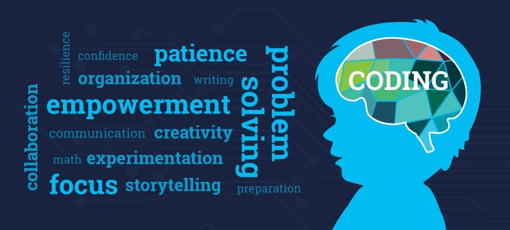
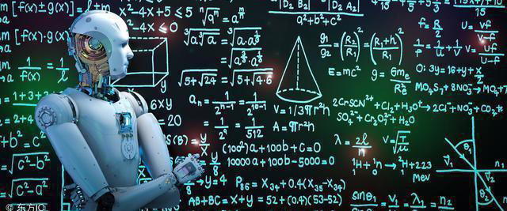

===================================
青少年为什么要学习计算机编程
===================================

随着科技的发展，编程学习也是全球化的趋势，国内编程学习热潮日盛。越来越多的家长开始让孩子接触学习编程。近年来，很多家长知道学习编程对孩子有很大的好处，却不知道编程的具体作用到底是什么？

未来是人工智能的时代，人工智能的出现将会取代现今社会中大部分职业。学习编程不仅教会孩子们编程技能，更重要的用编程思维，有逻辑地分析解决问题。不会编程，只能是未来科技的使用者，而学会编程，才是未来的创造者。编程技能才是在人工智能时代立于不败之地的核心能力。

马云曾对未来行业进行过预测，他表示未来10年，中国将会有50%的工作消失。

马云预测，其中这4个行业可能性更大

- 司机。随着时代不断的进步以及科技迅速发展，无人驾驶的技术将会越来越成熟，在未来也极有可能会投入市场，那么司机这个行业也将逐渐被替代掉。
- 银行职员。自从移动支付时代到来之后，我们去银行的次数已经越来越少了，没有一部手机解决不了的事情，有了ATM机和业务一体机，银行更加不需要那么多人手了。
- 流水线工人。在以前行业并没有这么多，下工厂成为了很多人的选择，门槛比较低，并且工作稳定，工资也算还行。 但是在未来，随着智能制造的发展和工业机器人的大量应用，用工将越来越少，通过看福耀玻璃纪录片《美国工厂》就可见一斑。
- 翻译。以前能够会一口流利的外语，都会被人们投去羡慕的眼光， 随着科技的发达这种工作也失去了往日的风采。市面上已经有越来越多的翻译软件和设备，可以实现翻译功能，并且准确率已经达到了99%，甚至还能做到“同声传译”。

既然可以肯定，未来30年是人工智能的伟大时代，那么学编程不仅不会让孩子失败在起跑线上，更会让孩子的未来充满更多可能性。

编程，通俗的讲就是编写程序，用计算机语言把人类的一些思路、方法和手段告诉计算机，让计算机按照我们的指令，一步一步去工作，最终完成相应的任务。
而人和计算机之间的这种交流称之为编程。那么学习编程，会给青少年带来这几大好处：

- 提高数学成绩
- 提高创造力
- 提升沟通能力
- 培养专注力和细心度
- 提前进行职业准备

我们的生活正在慢慢地被人工智能所取代，推广人工智能科普教育迫在眉睫。在未来的20年，编程或许不再是高考的选项，而是标配。
学习编程，提前准备高考：2017年，浙江、山东等地把编程正式升级为高考科目，2018年江苏卷出现了涵盖编程思维的考题，此外编程学的好的孩子，可以享受重点大学降分录取或者自主招生的面试资格。
人无远虑，必有近忧。相信不久的未来将会有更多的地方把编程纳入高考当中。
未来编程将会成为孩子在工作面试的重要关卡，与其被动等待，不如主动出击，深扎编码基础能力，磨炼逻辑思维能力，加强动手实践能力，做一名真正的程序员高手。

