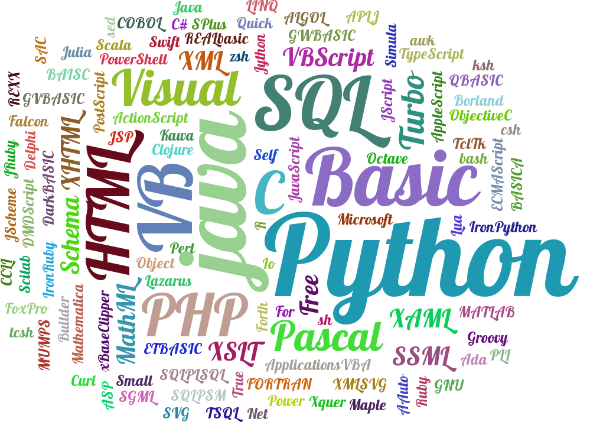
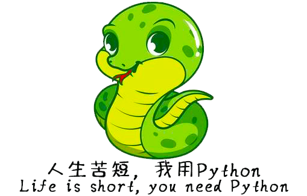

=========================
什么是计算机编程
=========================

计算机程序是一组让计算机执行某种动作的命令。
和那些可以触碰的计算机硬件不同，是运行在计算机硬件上的逻辑指令集合。
程序的集合通常被称为软件。电脑游戏，手机app软件，都是软件。
如果你会写计算机程序，你就可以做很多事情。

-----------------------
什么是计算机语言
-----------------------

和人类一样，计算机也可以使用多种语言。这里所说的语言，就是计算机编程语言。
简单的说，一种编程语言，就是一种人类与计算机进行交流的方式，这种方式可以使人和计算机都能理解。
计算机编程的历史上，有过很多的编程语言。

-------------------------------------------
什么是python语言，为什么学习python语言
-------------------------------------------

本书主要学习python技术，python语言特别适合初学者，并且功能强大，且应用场景很多。   
Python是时下最最火爆的编程语言之一，已经非常的流行并将会越来越流行，具体原因如下：

- 1. 简单、易学，适应人群广泛
- 2. 免费、开源
- 3. 应用领域广泛

以下就是python应用的主要领域：

- WEB开发
- 桌面软件
- 网络编程
- 爬虫开发
- 云计算开发
- 人工智能
- 自动化运维
- 金融分析
- 科学运算
   
以下知名框架均是Python语言开发：
   
   - 云计算框架：OpenStack
   - AI机器学习框架：Scikit-learn
   - Google开源人工智能深度学习框架：TensorFlow （阿尔法狗）
   
编者的经验，现在有很多的大项目，银行，保险，跨国科研等项目上，有很多的开发语言是python。

------------
你学到了什么
------------

什么是程序，以及Python特点。

 

   
 
