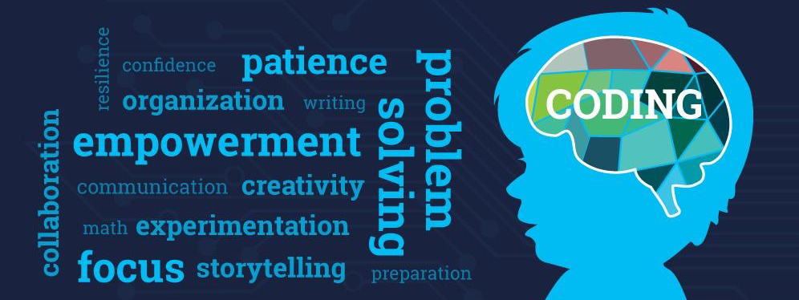

===================================
青少年为什么要学习计算机编程
===================================

随着科技的发展，编程学习也是全球化的趋势，国内编程学习热潮日盛。越来越多的家长开始让孩子接触学习编程。
近年来，很多家长知道学习编程对孩子有很大的好处，却不知道编程的具体作用到底是什么？

未来是人工智能的时代，人工智能的出现将会取代现今社会中大部分职业。学习编程不仅教会孩子们编程技能，更重要的用编程思维，有逻辑地分析解决问题。
不会编程，只能是未来科技的使用者，而学会编程，才是未来的创造者。编程技能才是在人工智能时代立于不败之地的核心能力。

马云曾对未来行业进行过预测，他表示未来10年，中国将会有50%的工作消失。

马云预测，其中这4个行业可能性更大

- 司机。随着时代不断的进步以及科技迅速发展，无人驾驶的技术将会越来越成熟，司机这个行业也将逐渐被替代掉。
- 银行职员。自从移动支付时代到来之后，我们去银行的次数已经越来越少了，有了ATM机和业务一体机，银行更加不需要那么多人手了。
- 流水线工人。门槛比较低，工作稳定，很多人去工厂。 但是随着智能制造的发展和工业机器人的大量应用，用工将越来越少，福耀玻璃纪录片《美国工厂》可见一斑。
- 翻译。以前会外语很吃香， 随着科技的发达这种工作也失去了往日的风采。市面上已经有越来越多的翻译软件和设备，可以取代翻译。

既然可以肯定，未来30年是人工智能的伟大时代，那么学编程不仅不会让孩子失败在起跑线上，更会让孩子的未来充满更多可能性。

编程，通俗的讲就是编写程序，用计算机语言把人类的一些思路、方法和手段告诉计算机，让计算机按照我们的指令，一步一步去工作，最终完成相应的任务。
而人和计算机之间的这种交流称之为编程。那么学习编程，会给青少年带来这几大好处：

- 提高数学成绩
- 提高创造力
- 提升沟通能力
- 培养专注力和细心度
- 提前进行职业准备

我们的生活正在慢慢地被人工智能所取代，推广人工智能科普教育和青少年编程迫在眉睫。

在未来的20年，编程或许不再是高考的选项，而是标配。
学习编程，提前准备高考：有据可查，2017年，浙江、山东等地把编程正式升级为高考科目，2018年江苏卷出现了涵盖编程思维的考题。
人无远虑，必有近忧。相信不久的未来将会有更多的地方把编程纳入高考当中。
此外编程学的好的孩子，可以享受重点大学自主招生的面试资格。
未来编程将会成为孩子在工作面试的重要关卡，与其被动等待，不如主动出击。
学习编程基础能力，磨炼逻辑思维能力，加强动手实践能力，做一名真正的编程高手。

补充信息：重大改革！Python将被加入高考科目！
近期，浙江省信息技术课程改革方案出台，Python 确定进入浙江省信息技术高考。
从2018年起浙江省信息技术教材编程语言将会从 VB 更换为Python。
也就是说，Python 语言将纳入高考科目！浙江新高考实行三年来，技术选考报名人数逐年上升，2019 届达到约 10 万人，占总报名人数的 40% 。
仅仅是浙江省，在高考选考科目实际的申报过程中，有 48 所 211 高校的330 个专业将技术列为选考科目要求。（没错是选考）浙江大学、南开大学、南京大学、中国地质大学等「 211 高校」均有专业把技术作为选考科目。
以浙大为例，在已公布的 24 个专业(类)中，科技与创意设计试验班选考科目范围是 2 门：物理和技术。虽然我们的孩子还小，但是在学习的路上永远只有提前，没有落后，我们应该从这些教育上的改革中看到一些具有前瞻性的东西。
