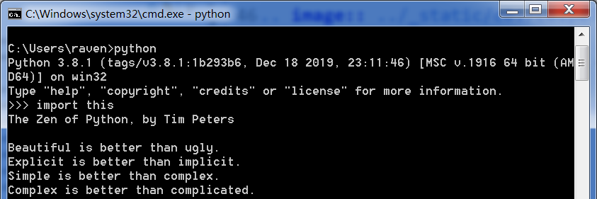

========================
Python的解释器安装与使用
========================

我们将要学习的是python，python语言是解释型语言，需要使用专门的解释器对源程序逐行解释成特定平台的机器码并立即执行。

python程序，需要运行在特定平台上，平台带有相应的解释器，就可以运行python源代码。所以首先我们需要准备好python的解释器。

-----------------------------
下载Python解释器
-----------------------------

打开解释器的  `[python解释器3.81——https://www.python.org/downloads/release/python-381/] <https://www.python.org/downloads/release/python-381/>`_ 页面。

查找我们需要的python解释器3.8安装版：Windows x86-64 executable installer 单击即可下载。

-------------------------------
安装Python解释器
-------------------------------

双击可执行文件，并勾选添加环境变量，按照客户设置进行安装  ：

下一步，检查默认附加选项是否都被勾选上，按提示操作即可：

.. image:: ../_static/c01/c01p02_i03_installpython2.png

-------------------------
检查解释器安装是否成功
-------------------------

用 ``Win+R`` 键，打开运行对话框，在其中输入 ``cmd`` ,打开命令行工具。
在命令行工具内输入 ``python`` 命令，打开python的交互式解释器，在其中会提示当前解释器的版本号。

在Python交互式解释器中输 入 ``import this`` ,就会显示Python之禅：

看到上述现象，说明python解释器安装成功。

---------------------
读一读Python之禅
---------------------

读一读Python之禅，你就明白Python为什么如此吸引人：

.. code-block:: console

   The Zen of Python, by Tim Peters
   
   Beautiful is better than ugly.
   Explicit is better than implicit.
   Simple is better than complex.
   Complex is better than complicated.
   Flat is better than nested.
   Sparse is better than dense.
   Readability counts.
   Special cases aren't special enough to break the rules.
   Although practicality beats purity.
   Errors should never pass silently.
   Unless explicitly silenced.
   In the face of ambiguity, refuse the temptation to guess.
   There should be one-- and preferably only one --obvious way to do it.
   Although that way may not be obvious at first unless you're Dutch.
   Now is better than never.
   Although never is often better than *right* now.
   If the implementation is hard to explain, it's a bad idea.
   If the implementation is easy to explain, it may be a good idea.
   Namespaces are one honking great idea -- let's do more of those!

中文翻译和解释:

.. code-block:: console
   
   优美胜于丑陋（Python 以编写优美的代码为目标）
   明了胜于晦涩（优美的代码应当是明了的，命名规范，风格相似）
   简洁胜于复杂（优美的代码应当是简洁的，不要有复杂的内部实现）
   复杂胜于凌乱（如果复杂不可避免，那代码间也不能有难懂的关系，要保持接口简洁）
   扁平胜于嵌套（优美的代码应当是扁平的，不能有太多的嵌套）
   间隔胜于紧凑（优美的代码有适当的间隔，不要奢望一行代码解决问题）
   可读性很重要（优美的代码是可读的）
   即便假借特例的实用性之名，也不可违背这些规则（这些规则至高无上）
   不要包容所有错误，除非你确定需要这样做（精准地捕获异常，不写 except:pass 风格的代码）
   当存在多种可能，不要尝试去猜测
   而是尽量找一种，最好是唯一一种明显的解决方案（如果不确定，就用穷举法）
   虽然这并不容易，因为你不是 Python 之父（这里的 Dutch 是指 Guido ）
   做也许好过不做，但不假思索就动手还不如不做（动手之前要细思量）
   如果你无法向人描述你的方案，那肯定不是一个好方案；反之亦然（方案测评标准）
   命名空间是一种绝妙的理念，我们应当多加利用（倡导与号召）

从python之禅，可以看到python有如下特点：

- Python 是一种解释型语言： 这意味着开发过程中没有了编译这个环节。
- Python 具有很强的可读性。
- Python 支持交互式： 这意味着，您可以在一个 Python 提示符 >>> 后直接执行代码。
- Python 是面向对象语言: 这意味着Python完全支持面向对象开发。
- Python 初学者友好：Python 对初级程序员而言，是一种易于学习的语言。

那么后续深入学习过程中，我们会进一步体会python语言的这些特点。

---------------
动手练习
---------------

练习安装python解释器。

------------
你学到了什么
------------

 

   
 
