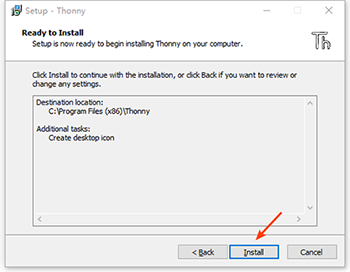
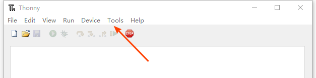
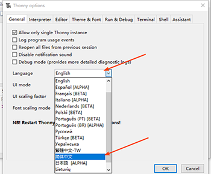
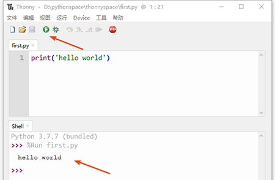

=======================
Python集成开发环境准备
=======================

集成开发环境（IDE，Integrated Development Environment ）是用于提供程序开发环境的应用程序。
一般包括代码编辑器、编译器、调试器和图形用户界面等工具。
集成了代码编写功能、分析功能、编译功能、调试功能等一体化的开发软件服务套。
所有具备这一特性的软件或者软件套（组）都可以叫集成开发环境。

常用的python集成开发环境很多，专业用户经常使用Pycharm。
对初学者来说，Thonny比较简洁高效。所以我们先学习Thonny。

--------------
下载thonny
--------------

`[Thonny—— https://thonny.org/] <https://thonny.org/>`_

.. image:: ../_static/c01/c01p03_i01_thonnydownload.png
 

--------
安装
--------

下载后，双击安装包，按照下述步骤进行安装。

.. image:: ../_static/c01/c01p03_i02_thonnyinstall.png
   :height: 350 

.. image:: ../_static/c01/c01p03_i03_thonnyinstall2.png
   :height: 350 
   
.. image:: ../_static/c01/c01p03_i04_thonnyinstall3.png
   :height: 350 
   

   
--------------------------------
设置Thonny编辑器的语言为中文
--------------------------------

在Thonny首次运行时，可以设置语言.
如果错过了设置，也可以在的设置内，可以设置整个编辑器的语言为中文。
在菜单栏内选择Tools选项：

打开Option选项，打开设置窗口，在Language下拉选择框内，选择简体中文选项：

点击OK按钮确认设置，然后重启Thonny编辑器，即可设置编辑器为中文。

----------------------------
Thonny编辑器的基本使用
----------------------------

接着，即可开始使用Thonny进行编程开发了。

**创建python文件**

点击 “文件” 选择“新文件”，这时，tab页编辑区，就打了一个新的待编辑python文件。

编辑第一个python程序，并保存为first.py，python文件都是以py为后缀结尾。

双击打开文件，并书写一个最简单的helloworld代码：

.. code-block:: python

   print("hello world")

点击编辑器的保存图标按钮，对现在进行编辑的文件进行保存，存储到磁盘的某一个位置。
点击绿色的运行按钮，或者点击快捷键‘F5’，运行这个python程序。运行效果会出现在Shell区域。
下面是运行效果：

print是打印函数。在python中，调用函数的方式是函数名称加括号。此段程序命令的含义，是在终端中，打印出字符串“hello world”。

.. note:: 

    此处是print函数被调用的一个过程。函数调用是指，我们可以直接调用一个系统提前定义好的函数功能，通过函数名称跟随一个括号的形式进行调用，如果函数有参数，则放到括号内。函数会在被调用的地方执行。在本教材的第八章，会展开对函数进行讲解，现阶段只要明白函数是调用一个预先定义好的功能进行某种处理即可。

**载入python文件**

那么程序的特点是什么？
程序的特点是一次编写，多处使用。
所以，程序编辑完成后，需要进行打开操作，并可以再次执行。

点击 “文件” 选择“打开”，这时，会打开文件选择对话框，从里面选择我们要进行编辑的python文件，打开后，就可以进行再次编辑。

---------------
动手练习
---------------

练习安装Thonny，并练习新建python文件并，开发第一个成型helloworld并保存。
再次运行Thonny并载入之前保存的python文件。

------------
你学到了什么
------------

什么是集成开发环境，Thonny环境如何安装，如何用Thonny环境如何开发第一个python程序
