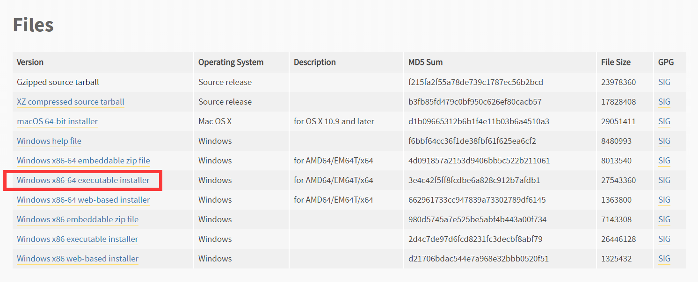
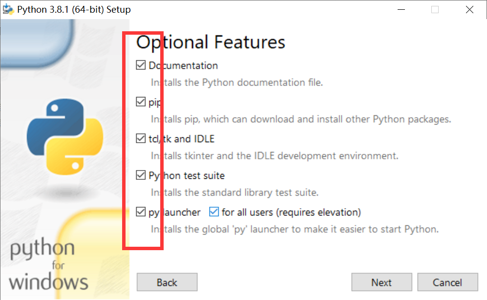
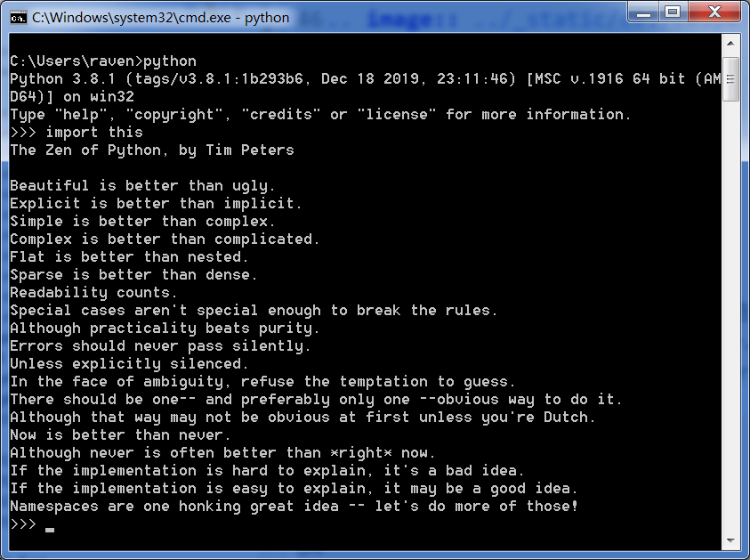

=====================
Python开发环境准备
=====================

------------
目标
------------

- 解释器的作用
- 下载Python解释器
- 安装Python解释器

-----------------------------
下载Python解释器
-----------------------------

打开解释器的  `[python解释器——下载地址] <https://www.python.org/downloads/release/python-381/>`_ 页面。

查找我们需要的python解释器3.8安装版：Windows x86-64 executable installer 单击即可下载。

-------------------------------
安装Python解释器
-------------------------------

双击可执行文件 -- [Next] -- [勾选添加环境变量] -- 按照客户设置进行安装  ：

.. image:: ../_static/c01/c01p07installpython.png

 -- 检查默认附加选项是否都被勾选上 -- [Next]，按提示操作即可：

-------------------------
检查解释器安装是否成功
-------------------------

用 ``Win+R`` 键，打开运行对话框，在其中输入 ``cmd`` ,打开命令行工具。
在命令行工具内输入 ``python`` 命令，打开python的交互式解释器，在其中会提示当前解释器的版本号。
在Python交互式解释器中输 入 ``import this`` ,就会显示Python之禅：

看到上述现象，说明python解释器安装成功。

------------
你学到了什么
------------

- 什么是解释器
- 解释器环境如何安装

 

   
 
