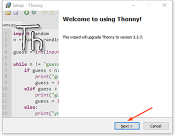
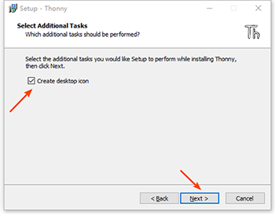

=======================
Python集成开发环境准备
=======================

------------
目标
------------

- 了解什么是IDE
- 常用IDE介绍
- 学习和使用

------------
什么是IDE
------------

集成开发环境（IDE，Integrated Development Environment ）是用于提供程序开发环境的应用程序，一般包括代码编辑器、编译器、调试器和图形用户界面等工具。
集成了代码编写功能、分析功能、编译功能、调试功能等一体化的开发软件服务套。所有具备这一特性的软件或者软件套（组）都可以叫集成开发环境。

常用的python集成开发环境很多，专业用户经常使用pycharm和pydev。对初学者来说，thonny比较简洁高效。

--------------
下载thonny
--------------

`[Thonny—— https://thonny.org/] <https://thonny.org/>`_

.. image:: ../_static/c01/c01p03_i01_thonnydownload.png
 

--------
安装
--------

下载后，双击安装包，按照下述步骤进行安装。

.. image:: ../_static/c01/c01p03_i03_thonnyinstall2.png

.. image:: ../_static/c01/c01p03_i05_thonnyinstall4.png

----------------------------
PyCharm的基本设置与使用
----------------------------

------------
你学到了什么
------------

- 什么是解释器
- 解释器环境如何安装
- python之禅和python语言特点
 

   
 
