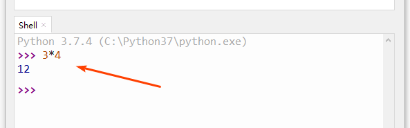

=====================
用python来做计算
=====================

---------------------
python的数值类型
---------------------

Python 支持三种不同的数值类型：

- 整型(Int) - 通常被称为是整型或整数，是正或负整数，不带小数点。Python3 整型是没有限制大小的。
- 浮点型(float) - 浮点型由整数部分与小数部分组成，浮点型也可以使用科学计数法表示（2.5e2 = 2.5 乘以10的2次方 = 250）
- 复数(complex) - 复数由实数部分和虚数部分构成，可以用a + bj,或者complex(a,b)表示， 复数的实部a和虚部b都是浮点型。

我们可以通过type命令，来查看一个数值的数据类型：

.. code-block:: python

   >>> type(3)
   <class 'int'>
   >>> type(3.4)
   <class 'float'>

--------------
算数运算符
--------------

一般来讲，对我们在学校学习的数学计算方式，计算“3乘以4”的表示方法是：``3×4``
那么，在python中如何表达呢？
注意，在python中，将表示成 ``3*4``
乘法用星号来表示。

那么如何执行这个乘法计算呢？

可以再windows的命令行工具内，激活python状态，并进行计算。

更直接的，可以到集成开发环境Thonny的Shell对话框内，直接敲击``3*4``并回车，即可进行乘法计算：

常用的python数学运算符列举：

============ ============= ==========================================================
 运算符          描述                                           实例                                                   
============ ============= ==========================================================
 ``+``           加                           1 + 1 输出结果为 2                                    
 ``-``           减                           1-1 输出结果为 0                                      
 ``*``           乘                           2 * 2 输出结果为 4                                    
 ``/``           除                           10 / 2 输出结果为 5                                   
 ``//``         整除                          9 // 4 输出结果为2                                    
 ``%``          取余                          9 % 4 输出结果为 1                                    
 ``**``         指数                          2 ** 4 输出结果为 16，即 2 * 2 * 2 * 2                
 ``()``         小括号                      小括号用来提高运算优先级，即 (1 + 2) * 3 输出结果为 9 
============ ============= ==========================================================

--------------
运算的顺序
--------------

注意：混合运算优先级顺序：``()`` 高于  ``**``  高于  ``*`` , ``/`` , ``//`` , ``%``  高于  ``+`` , ``-``

------------
思考与练习
------------

一个人，有一个100元，3个50元，3个20元，6个10元，

------------
你学到了什么
------------

