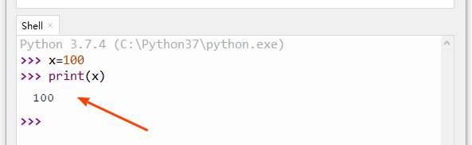

=====================
如何使用变量
=====================

--------------
目标
--------------

- 了解什么是变量
- 学习创建和使用变量
- 注释的特点

--------------
变量就是标签
--------------

在计算机程序中，变量这个词，就是指储存信息的地方，可以储存数字、文本等信息。变量就好像贴在这些信息上面的标签。就类似于数学方程中的变量X。

如何创造一个变量？

如果创造一个变量，需要使用到等于号 ``=`` ，例如：

.. code-block:: python

   x=100

给一个值贴标签，或者给一个标签赋值之后，如何查看变量的值？
很简单，用到我们之前学习过的打印函数print,来直接查看x变量的值：

--------------
变量值的变更
--------------

我们也可以令python，改变变量的值，就是令变量标签指向其他值。

.. code-block:: python

   >>> x=200
   >>> print(x)
   200

----------------------
变量的数据类型
----------------------

上一节，我们学习了用type函数来查看一个数值的数据类型。
那么，变量是否也具有数据类型？是否可以通过type命令来检查？
答案是可以的：

.. code-block:: python

   >>> a=10
   >>> type(a)
   <class 'int'>
   
   >>> b=10.5
   >>> type(b)
   <class 'float'>
   
   >>> c=a+b
   >>> c
   20.5
   
   >>> type(c)
   <class 'float'>

------------
思考与练习
------------

------------
你学到了什么
------------

