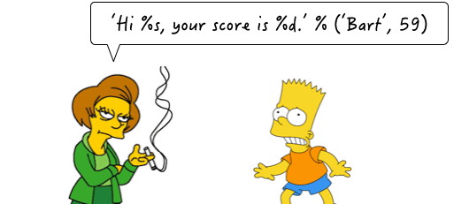

=====================
字符串
=====================

------------------
认识字符串
------------------

在编程术语中，我们通常把文字称为“字符串”。我们可以把字符串想象成一堆字符的组合。
字符串是 Python 中最常用的数据类型。我们一般使用引号来创建字符串。所有的字母，数字，符号，文字，都可以看作是一个字符串。
事实上，第一章我们学到的``print("hello world")``中的“Hello World”就是一个字符串。

创建字符串很简单，只要为变量分配一个值即可。

.. code-block:: python

   a = 'hello world'
   b = "abcdefg"
   print(type(a))
   print(type(b))

控制台显示结果为 ``<class 'str'>`` ， 即数据类型为str(字符串)。

创建一个字符串可以用单引号，双引号，也可以用一对三个单引号或者双引号创建一个字符串，这种字符串支撑换行。
注意，创建字符串的引号，是英文的引号而非中文的引号。而且引号需要成对出现。

一对引号字创建的符串：

.. code-block:: python

   name1 = 'Jack'
   name2 = "Rose"

用三个引号创建字符串，引号的类型前后需要一致。一般是用来记录多行字符串构成的一段文字，请看下面的字符串：

.. code-block:: python

   name3 = '''Jack'''
   name4 = """Rose"""
   a = ''' i am Jack, 
           nice to meet you! '''
   
   b = """ i am Rose, 
           nice to meet you! """

思考：如果创建一个字符串 ``I'm Tom`` ?

.. code-block:: python

   c = "I'm Tom"
   d = 'I\'m Tom'

这里使用了反斜杠，反斜杠加字符的形式叫做``转义字符``，转义字符的目的是表达一些无法用字符表达的含义。

========= ======================
转义字符  描述
========= ======================
``\\``          反斜杠符号
``\'``          单引号
``\"``          双引号
``\n``          换行
``\t``          制表符
``\r``          回车
========= ======================

------------------
字符串里嵌入值
------------------

 一个常见的问题是如何输出格式化的字符串。我们经常会输出类似'亲爱的xxx你好！你xx月的话费是xx，余额是xx'之类的字符串，而xxx的内容都是根据变量变化的，所以，需要一种简便的格式化字符串的方式。
这时，我们可以使用``print`` 函数，向控制台终端打印时，
利用 ``%s`` 来把值嵌入到字符串里面，这个符号就好比是你为以后要加入的值所做的一个标记。

打印出你想看到的字符串，可以这样实现：

.. code-block:: python

   print('Hi %s,your score is %d' % ('Bart',59))

你可能猜到了，%运算符就是用来格式化字符串的。
在字符串内部，%s表示用字符串替换，%d表示用整数替换，有几个%?占位符，后面就跟几个变量或者值，顺序要对应好。
如果只有一个%?，括号可以省略。
常见的占位符有：

======= =============
%d         整数

%f         浮点数

%s         字符串
======= =============

在看一些具体例子：

.. code-block:: python

   name = 'Jack'
   print('我的名字是%s' % name)
   print('我的年龄是%d' % 13)
   
------------------
字符串的输入
------------------

字符串输出的方法，之前介绍过

那么字符串输入如何实现呢？
在Python中，使用``input()``函数，来接收用户的输入： 

.. code-block:: python

   >>> name=input('请输入名字：\n')
   请输入名字：
   woo
   >>> name
   'woo'

-------------
下标
-------------

“下标”又叫“索引”，就是编号。比如火车座位号，座位号的作用：按照编号快速找到对应的座位。
这个下表或者索引，类似数学数列中的编号。下标的作用即是，当我们使用字符串时，通过下标快速找到对应的数据。

比如，有一个字符串``name = "abcdef"`` ，我们如何快速的取到name这个字符串里面，不同位置对应的字符串呢?

.. code-block:: python

   name = "abcdef"   
   print(name[1])
   print(name[0])
   print(name[2])
 
注意：下标从``0``开始。

 
----------------------
字符串的修改
----------------------
 
**字符串替换**

所谓修改字符串，指的就是通过函数的形式修改字符串中的数据。
我们使用``replace()``函数，来实现对字符串的替换：

.. code-block:: python

   字符串序列.replace(旧子串, 新子串)

我们看一下例子：

.. code-block:: python

   mystr = "hello world and itcast and itheima and Python"
   
   # 结果：hello world he itcast he itheima he Python
   print(mystr.replace('and', 'he'))
   # 结果：hello world he itcast he itheima he Python
   print(mystr.replace('and', 'he', 10))
   # 结果：hello world and itcast and itheima and Python
   print(mystr)
 

**capitalize()**

将字符串第一个字符转换成大写。

.. code-block:: python

   mystr = "hello world and itcast and itheima and Python"
   
   # 结果：Hello world and itcast and itheima and python
   print(mystr.capitalize())

*注意*

capitalize()函数转换后，只字符串第一个字符大写，其他的字符全都小写。

**title()**

将字符串每个单词首字母转换成大写。

.. code-block:: python

   mystr = "hello world and itcast and itheima and Python"
   
   # 结果：Hello World And Itcast And Itheima And Python
   print(mystr.title())

**lower()**

将字符串中大写转小写。

.. code-block:: python

   mystr = "hello world and itcast and itheima and Python"
   
   # 结果：hello world and itcast and itheima and python
   print(mystr.lower())

**upper()**

将字符串中小写转大写。

.. code-block:: python

   mystr = "hello world and itcast and itheima and Python"
   
   # 结果：HELLO WORLD AND ITCAST AND ITHEIMA AND PYTHON
   print(mystr.upper())

**strip()**

删除字符串两侧空白字符。

.. code-block:: python

   a='  123  '
   print(a.strip())
 
------------
思考与练习
------------

------------
你学到了什么
------------

