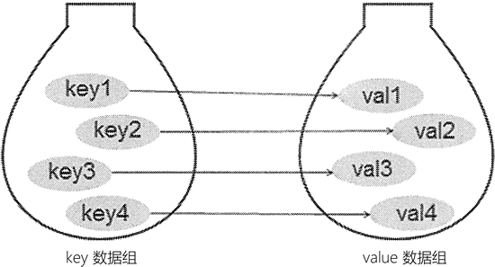

=====================
字典:dict 
=====================

python中的字典是dict，是单词dictionary的缩写。
是Python 提供的一种常用的数据结构，它用于存放具有映射关系的数据。

比如有份成绩表数据，语文：79，数学：80，英语：92，这组数据看上去像两个列表，但这两个列表的元素之间有一定的关联关系。
如果单纯使用两个列表来保存这组数据，则无法记录两组数据之间的关联关系。

为了保存具有映射关系的数据，Python 提供了字典，字典相当于保存了两组数据，
其中一组数据是关键数据，被称为 key；另一组数据可通过 key 来访问，被称为 value。
形象地看，字典中 key 和 value 的关联关系如图所示：

由于字典中的 key 是非常关键的数据，而且程序需要通过 key 来访问 value，因此字典中的 key 不允许重复。

--------------------
如何创建字典
--------------------

程序既可使用花括号语法来创建字典，也可使用 dict() 函数来创建字典。
在使用花括号语法创建字典时，花括号中应包含多个 key-value 对，key 与 value 之间用英文冒号隔开；多个 key-value 对之间用英文逗号隔开。

字典创建的特点：

   - 符号为大括号
   - 数据为键值对形式出现
   - 各个键值对之间用逗号隔开

如下代码示范了使用花括号语法创建字典： 

.. code-block:: python
        
   scores = {'语文': 89, '数学': 92, '英语': 93}
   print(scores)
   
   # 空的花括号代表空的字典
   empty_dict = {}
   print(empty_dict)
   
   # 使用数字作为dict的key
   dict2 = {20:'good', 30:'bad'}
   print(dict2)  
 
注意：一般称冒号前面的为键(key)；冒号后面的为值(value)。

----------------------
查询dict里面的值
----------------------

**用方括号获取**

利用key值查找dict里面的元素值的方式：

.. code-block:: python

   dict1 = {'name': 'Tom', 'age': 20, 'gender': '男'}
   print(dict1['name'])  # Tom
   print(dict1['id'])  # 报错

如果当前查找的key存在，则返回对应的值；否则则报错。

*用get()函数的方法获取*

用get函数获取dict里面的值的的方法是: ``字典.get(key)``

注意：如果当前查找的key不存在则返回None。

.. code-block:: python

   dict1 = {'name': 'Tom', 'age': 20, 'gender': '男'}
   print(dict1.get('name'))  # Tom
   print(dict1.get('id', 110))  # 110
   print(dict1.get('id'))  # None

----------------
字典常见操作
----------------

**增加元素**

向dict里面增加元素的写法是： ``字典[key] = 值``

注意：如果key存在则修改这个key对应的值；如果key不存在则新增此键值对。
 

.. code-block:: python

   dict1 = {'name': 'Tom', 'age': 20, 'gender': '男'}
   
   dict1['name'] = 'Rose'
   # 结果：{'name': 'Rose', 'age': 20, 'gender': '男'}
   print(dict1)
   
   dict1['id'] = 110
   
   # {'name': 'Rose', 'age': 20, 'gender': '男', 'id': 110}
   print(dict1)

注意：字典为可变类型。

**删除元素**

用del命令删除字典或删除字典中指定键值对：

.. code-block:: python

   dict1 = {'name': 'Tom', 'age': 20, 'gender': '男'}
   
   del dict1['gender']
   # 结果：{'name': 'Tom', 'age': 20}
   print(dict1)

**改变元素值**

之前我们已经可以通过键来获取dict的值，那么我们获取到之后就可以直接改变：``字典[key] = 值``

注意：如果key存在则修改这个key对应的值 ；如果key不存在则新增此键值对。

------------
思考与练习
------------

新建一个字典，编写自己的学籍信息，key值可以是：姓名，性别，年龄，等等。

------------
你学到了什么
------------
