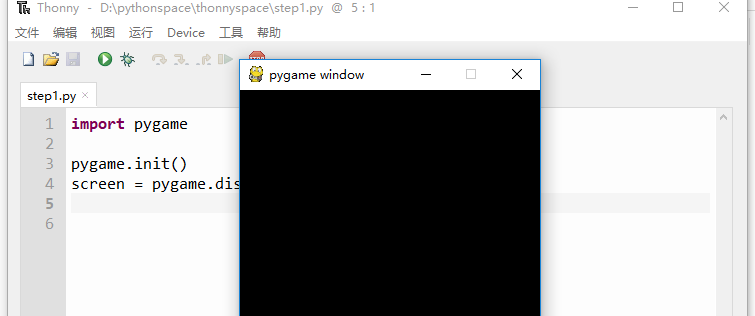
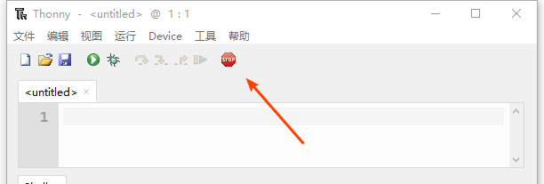

=======================
安装使用pygame的模块
=======================

----------
目标
----------

- 了解pygame
- 学会安装pygame
- 运行第一个pygame程序

-----------------------------
pygame了解和安装
-----------------------------

什么是Pygame？

Pygame是一个“游戏开发库” - 一组帮助程序员制作游戏的代码库。包含：

- 图形和动画
- 声音（包括音乐）
- 控制（键盘，鼠标，游戏手柄等）

Pygame已经存在很多时间了，许多优秀的程序员加入其中，把Pygame做得越来越好。

你可以从www.pygame.org下载Pygame，选择合适你的操作系统和合适的版本，然后安装就可以了。

当然，推荐大家用pip的方式安装pygame，输入 pip install pygame命令：

.. code-block:: console

   pip install pygame

-----------------
使用pygame
-----------------

下面我们看一下pygame的第一个程序：

**如何启动pygame**

.. code-block:: python

   import pygame
   
   pygame.init() #模块初始化，任何pygame程序运行前，均需要初始化
   screen = pygame.display.set_mode((300,480)) #定义窗口大小为640*480

pygame.init()是启动pygame，并“初始化”它的命令。
screen指的是游戏屏幕。

运行效果是：

**如何停止pygame程序**

正确的设置停止pygame程序将在后面详细讲解。
现在阶段还不能正常停止pygame程序窗口，只能点击集成开发环境Thonny的关闭按钮来关闭程序：

------------
思考与练习
------------

------------
你学到了什么
------------

- 了解pygame
- 学会了安装pygame
- 运行基本的pygame程序

 

