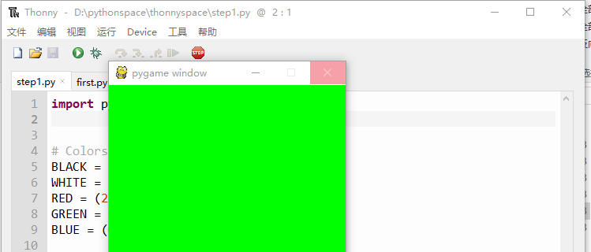

=======================
设置颜色
=======================

本节我们开始学习在pygame内设置颜色，先了解一下什么是RGB颜色。

-----------------------------
关于RGB颜色
-----------------------------

图像由像素组成，这些像素有3个部分：红色，绿色和蓝色。每个部分点亮多少会决定像素的颜色，如下所示：

三原色中的每一个可以具有介于0和255之间的值，因此对于三种基色中的每一种，存在256种不同的可能性。以下是一些三种颜色的组合示例：

.. image:: ../_static/c04/c04p02_i02_rgbcolor2.png

下面我们改变一下pygame的面板颜色：

首先，定义好一些颜色：

.. code-block:: python

   # Colors (R, G, B)
   BLACK = (0, 0, 0)
   WHITE = (255, 255, 255)
   RED = (255, 0, 0)
   GREEN = (0, 255, 0)
   BLUE = (0, 0, 255)

在绘图部分用特定色填满屏幕，这里我们先用绿色。

.. code-block:: python

    screen.fill(GREEN)

   
这样还不够。更改屏幕上的像素意味着告诉视频卡告诉显示器更改实际像素。从计算机的角度来看，这是一个非常非常缓慢的过程。因此，如果你在屏幕上绘制了很多东西，那么绘制它们可能需要很长时间。处理能力差的计算机表现为游戏运行卡顿。

我们可以通过使用称为双缓冲的技术，以巧妙的方式解决这个问题。

想象一下，有一个双面白板，可以翻转显示一侧或另一侧。前面是显示器（玩家看到的屏幕），而背面是隐藏的，只有计算机可以“看到”它。

每一帧，都在背面（内存中）绘制所有图画 - 每个角色，每个子弹，每个闪耀的光线等等。然后，当完成后，将白板翻转并显示。

这意味着每帧只是执行一次白板翻转的过程。

所有这些都在pygame中自动发生。完成绘图后，只需要告诉它翻转白板。命令为flip()

完整的程序是：

.. code-block:: python
   :linenos:

   import pygame   
   # Colors (R, G, B)
   BLACK = (0, 0, 0)
   WHITE = (255, 255, 255)
   RED = (255, 0, 0)
   GREEN = (0, 255, 0)
   BLUE = (0, 0, 255)
   
   pygame.init()
   screen = pygame.display.set_mode((300,480))
   
   screen.fill(GREEN)
   pygame.display.flip()

运行的效果是：

------------
思考与练习
------------

分别设置背景色为：红色、绿色、蓝色等。

------------
你学到了什么
------------

 
