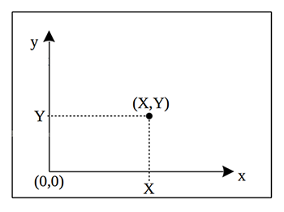
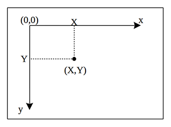

=======================
绘制矩形
=======================

下面我们来绘制矩形。
pygame使用pygame.draw模块内的函数来绘制图形。
pygame中的矩形绘制方式为是，pygame.draw.rect函数。
所以首先我们把对应的函数代入其中：

.. code-block:: python
   :linenos:
   
   import pygame
   
   # Colors (R, G, B)
   BLACK = (0, 0, 0)
   WHITE = (255, 255, 255)
   RED = (255, 0, 0)
   GREEN = (0, 255, 0)
   BLUE = (0, 0, 255)
   
   pygame.init()
   screen = pygame.display.set_mode((300,480))
   screen.fill(GREEN)
   
   #定义初始位置
   pos_x= 30
   pos_y= 20
   
   shape= pos_x, pos_y, 100, 100
   width= 2
   pygame.draw.rect(screen, BLUE, shape, width)
   
   pygame.display.update()

注意上述坐标定义初始位置的代码：``pos_x= 30`` 和 ``pos_y= 20`` 立面的坐标数字。
计算机图形学里面的坐标系，跟我们数学当中的坐标系是不一样的。
我们先来看看数学中，我们常用的笛卡尔坐标系：

但是，在计算机图形学立面，我们采用的是下面的坐标系：

根据我们的坐标系的知识，我就知道矩形应该出现的位置，运行效果：

----------------
如何设置图形填充
----------------

只要把绘制图形的width设置为零，则绘制过程就会实现颜色填充。下面，我们在原有矩形的下面，绘制一个用红色填充的图形：

.. code-block:: python
   :linenos:

   import pygame   
   # Colors (R, G, B)
   BLACK = (0, 0, 0)
   WHITE = (255, 255, 255)
   RED = (255, 0, 0)
   GREEN = (0, 255, 0)
   BLUE = (0, 0, 255)
   
   pygame.init()
   screen = pygame.display.set_mode((300,480))
   screen.fill(GREEN)
   
   #定义初始位置
   pos_x= 30
   pos_y= 20
   
   shape= pos_x, pos_y, 100, 100
   width= 2
   pygame.draw.rect(screen, BLUE, shape, width)
   
   
   shape= pos_x, pos_y+120, 100, 100
   width= 0
   pygame.draw.rect(screen, RED, shape, width)
   
   pygame.display.update()

看一下运行效果：

------------
思考与练习
------------

------------
你学到了什么
------------

- 了解pygame
- 学会了安装pygame
- 运行基本的pygame程序

 