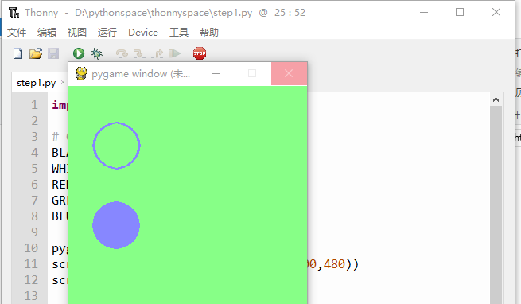

=======================
绘制圆形
=======================

pygame中的圆形绘制方式为是，pygame.draw.circle函数。
所以首先，把对应的函数代入其中：

.. code-block:: python
   :linenos:
   
   import pygame   
   # Colors (R, G, B)
   BLACK = (0, 0, 0)
   WHITE = (255, 255, 255)
   RED = (255, 0, 0)
   GREEN = (0, 255, 0)
   BLUE = (0, 0, 255)
   
   pygame.init()
   screen = pygame.display.set_mode((300,480))
   screen.fill(GREEN)
   
   #定义初始位置
   pos_x= 30
   pos_y= 20
   
   radius = 30
   position = 60,75
   width= 2
   
   pygame.draw.circle(screen, BLUE, position,radius,width)
   
   position2 = 60,175
   pygame.draw.circle(screen, BLUE, position2,radius,0)
   
   pygame.display.update()

运行效果：

------------
思考与练习
------------

绘制标靶

------------
你学到了什么
------------

- 了解pygame
- 学会了安装pygame
- 运行基本的pygame程序

 