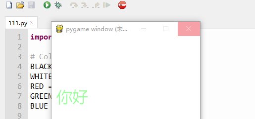

=======================
绘制字符串
=======================

pygame支持使用pygame.font对象将文本打印到窗口上。
要打印文本的话，首先需要创建一个字体对象，Font的第一个参数为None是告诉pygame获得系统默认字体，也可以是具体的字体名称。
Font的第二个参数指明字体大小。
下面我们设置字体为微软雅黑：

.. code-block:: python

   myfont=pygame.font.SysFont('microsoftyaheimicrosoftyaheiui',32)

文本绘制过程比较耗费时间，常用的做法是先在内存中创建文本图像，然后将文本当作一个图像来渲染。

.. code-block:: python

   textImage = myfont.render("pygame", True, WHITE)

上面代码中的render函数第一个参数是要绘制的文本，第二个参数是启用抗锯齿能力，第三个参数是文本的颜色。

为什么需要render渲染这步操作呢？
其实，每个文字都是图片，需要按照图片的信息进行显示，之所以我们在控制台直接可以打印出来，是因为控制台本身就是文字处理区，文字的绘制逻辑已经默认载入了。
pygame的图形绘制区域，文字也是需要按照字体和字号，渲染成图像，再绘制出来的。
所以，渲染出的testImage变量产生后，就可以使用screen.blit()函数，在绘图区域绘制把图形绘制出来。

下面将刚刚产生文本图像，采用screen.blit绘制到屏幕上：

.. code-block:: python

   screen.fill(BLACK)
   screen.blit(textImage, (10,100))
   pygame.display.flip()

所以整体的代码是：

.. code-block:: python

   import pygame
   
   # Colors (R, G, B)
   BLACK = (0, 0, 0)
   WHITE = (255, 255, 255)
   RED = (255, 0, 0)
   GREEN = (0, 255, 0)
   BLUE = (0, 0, 255)
   
   pygame.init()
   screen = pygame.display.set_mode((300, 480))
   
   myfont=pygame.font.SysFont('microsoftyaheimicrosoftyaheiui',32)
   textImage = myfont.render("你好", True, GREEN)
   
   screen.fill(WHITE)
   screen.blit(textImage, (10, 100))
   pygame.display.update()

绘制的效果是：

------------
思考与练习
------------

用pygame绘制字符串方式，显示自己的名字等信息。

------------
你学到了什么
------------
