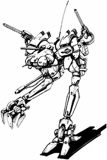
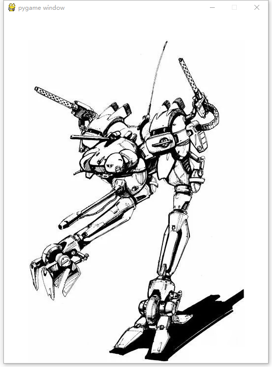
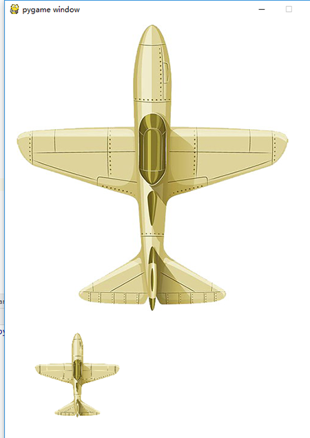
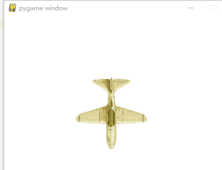
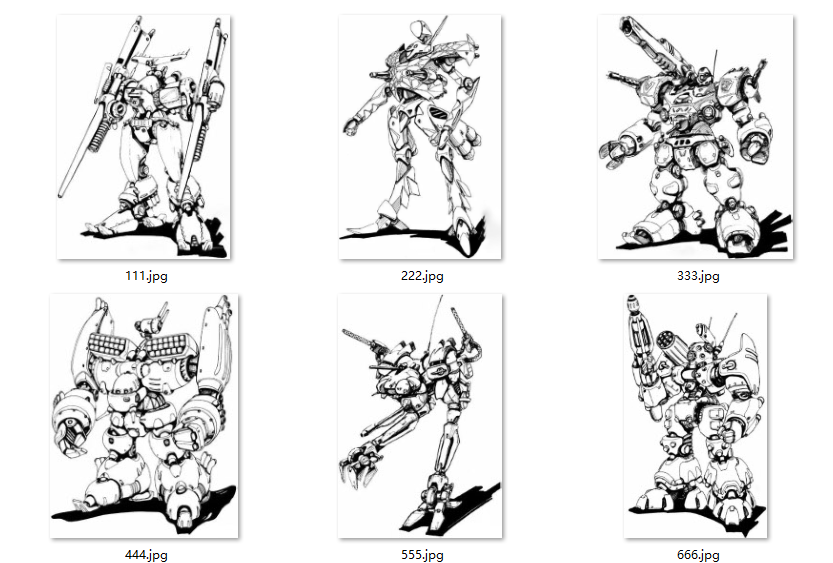

=======================
载入图片
=======================

由于前面学习了使用pygame的简单操作，现在学习当前的pygame怎么加载图片，为未来实现动画效果做准备。

那么我们开始准备载入图片，先准备一张图片，我们选取一张机器人图片：

根据这张图片的大小，我们设置窗口的大小比这张图片要大一点，所以设置窗口为540乘710。
那么我们就利用pygame.image.load函数，来载入制定的图片555.jpg。
文件名称是以字符串的形式传到载入函数内。
程序运行时，需要把图片放到和python源文件同一个目录下，以便载入程序能够找到这个图片文件。

载入的代码是：

.. code-block:: python
   :linenos:
   
   import pygame, sys
   
   pygame.init()
   screen = pygame.display.set_mode([540, 710])
   screen.fill([255, 255, 255])
   img = pygame.image.load("555.jpg")
   screen.blit(img, [50, 50])
   pygame.display.update()

机器人图片被载入的效果是：

-----------------
改变图片
-----------------

我们现在手头有飞机的图片,我们可以对图片进行缩放，以得到我们需要的大小
您可以使用pygame.transform.scale缩放图像：

.. code-block:: python
   :linenos:
   
   import pygame 
   
   pygame.init()
   screen = pygame.display.set_mode([540, 710])
   screen.fill([255, 255, 255])
   
   img = pygame.image.load("aircraft2.jpg")
   img2 = pygame.transform.scale(img, (140, 140))
   
   screen.blit(img, [20, 10])
   screen.blit(img2, [50, 520])
   pygame.display.update()

可见，飞机的图片被缩小了:

您可以使用pygame.transform.rotate缩放图像：

.. code-block:: python
   :linenos:
   
   import pygame
   
   WHITE = (255, 255, 255)
   pygame.init()
   screen = pygame.display.set_mode((480, 680), 0, 32)
   aircraft = pygame.image.load("aircraft2.jpg")
   aircraft = pygame.transform.scale(aircraft, (140, 140))
   aircraft = pygame.transform.rotate(aircraft, 180)
   pos_x = 140
   pos_y = 120
   screen.fill(WHITE)
   screen.blit(aircraft, (pos_x, pos_y))
   pygame.display.update()

可见，飞机的图片被旋转了180度:

------------
思考与练习
------------

尝试载入其他机器人图片，并尝试将多个机器人图片同时载入到一个窗口里面：

------------
你学到了什么
------------

