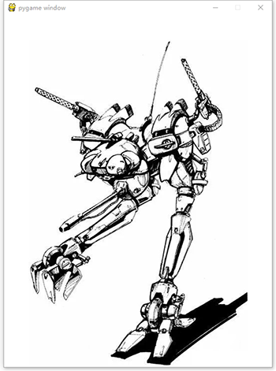

=======================
用pygame绘制图片
=======================

由于前面学习了使用pygame的简单操作，现在学习当前的pygame怎么加载图片，为未来实现动画效果做准备。

那么我们开始准备载入图片，先准备一张图片，我们找到一个python的logo图片：

根据这张图片的大小，我们设置窗口的大小比这张图片要大一点，所以设置窗口为540乘710。
那么我们就利用pygame.image.load函数，来载入制定的图片555.jpg，需要把图片放到和python源文件同一个目录下：

.. code-block:: python

   import pygame, sys
   
   pygame.init()
   screen = pygame.display.set_mode([540, 710])
   screen.fill([255, 255, 255])
   img = pygame.image.load("555.jpg")
   screen.blit(img, [50, 50])
   pygame.display.flip()

载入的效果是：

------------
思考与练习
------------

尝试载入其他机器人图片，并尝试将多个机器人图片同时载入到一个窗口里面：

------------
你学到了什么
------------

 

