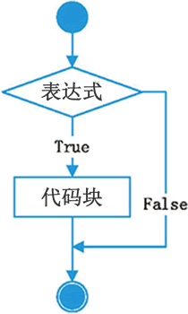
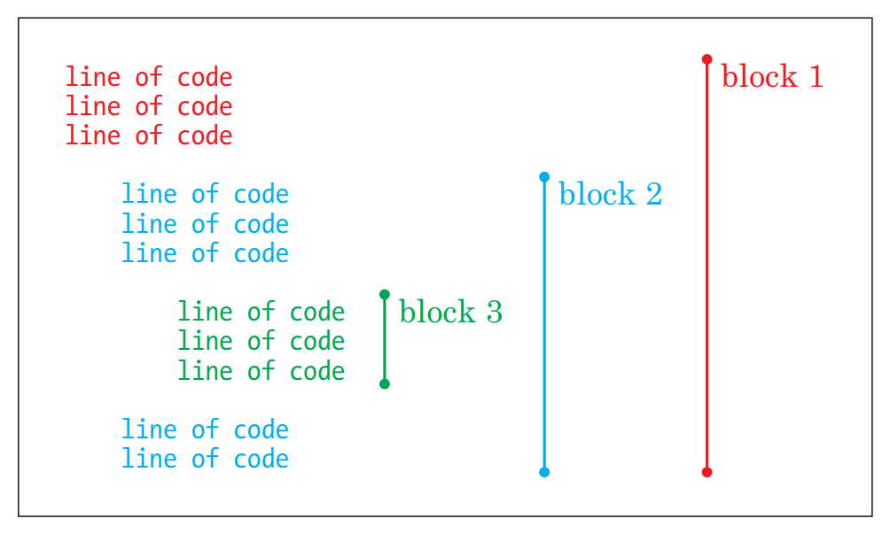
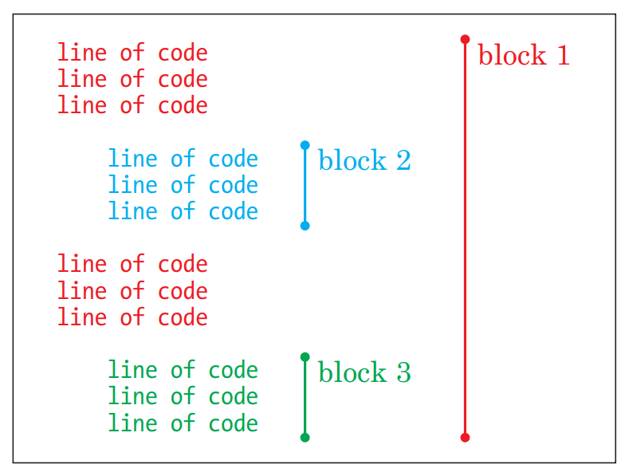
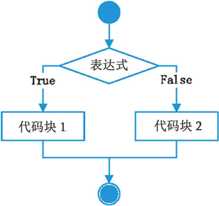
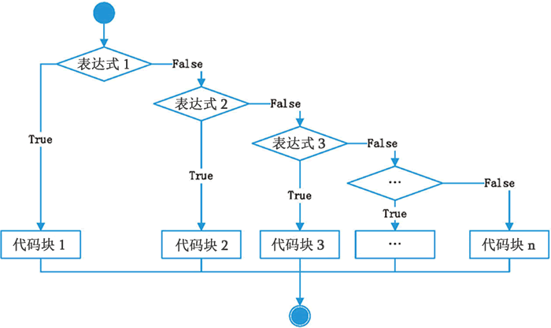

===================
条件语句
===================

----------
目标
----------

- 条件语句作用
- if语法
- if...else...
- 多重判断
- if嵌套

-------------------------
if语句
-------------------------

Python条件语句是通过一条或多条语句的执行结果（True或者False）来决定执行的代码块。
可以通过下图来简单了解条件语句的执行过程:

具体的，假设在网吧前台有这样一段程序：
如果用户年龄大于等于18岁，即成年，输出"已经成年，可以上网"。
那么，在python中，用if语句来实现可以这样写：

.. code-block:: python

   age = 20
   if age >= 18:
       print('已经成年，可以上网')

这段程序是if语句，意思是如果年龄大于18岁，则打印出可以上网的信息。
if语句是由``if``关键字构成的，后面跟着一个条件和一个冒号``:`` 。冒号之后的代码必须放到一个“语句块”中。
如果if的判断是真（True）的话，就会运行语句块中的命令。
那么让我们来看看如何写语句块。

----------------------------
语句块就是一组语句
----------------------------

通过对上述代码的观察，我们发现，if语句表达式的冒号后的一行，进行了缩进，这是为什么呢？
实际上，if语句后面的一行，是python代码的一个语句块。

语句块是什么呢？
语句块就是由具有相同缩进量的若干条语句，组合在一起的一组程序语句。英文是block。

例如，我在检查了上网顾客的年龄的时候，如果满足要求了，那么我还要在可以上网的信息后，再添加一句“欢迎光临”和一句“请缴费！”，那么我就可以这样实现：

.. code-block:: python

   age = 20
   if age >= 18:
      print('已经成年，可以上网')
      print('欢迎光临！')   
      print('请缴费！')   

也就是说，if判断语句之后的这个代码块，由三个print语句组成，只有当条件``age >= 18``为真时才会运行。 
和前面的if语句相比，这个代码块中的每一行都具有相同的缩进，就是每一行前面都有一个tab符。

下面的伪代码（并非真正的Python代码）展示了缩进的工作方式：

.. code-block:: console

   这是语句块A的一行语句
   这是语句块A的一行语句
      这是一个新语句块B
      继续B这个语句块
      这个语句块B的最后一句
   这里我们退出语句块B，继续执行语句块A

在python中，空白是有意义的，处于同一位置的相同缩进的代码，组成一个代码块，只要你新起了一行，并进行了缩进，那么你就开始了一个新的代码块。

并且这个新开的语句块，是前一个代码块的一部分：

也就是说，缩进之后，再次缩进，那么缩进产生的语句块，隶属于上面的语句块。

我们把这些语句组合再一起因为他们是相关的。这些语句需要一起执行。

当你改变你的缩进的时候，实际上是在新建立一个代码块。下面的例子是通过改变缩进建立了三个不同的代码块：

这里，虽然代码块2和3有相同的缩进，但是他们是不同的代码块，因为中间隔着一段独立的代码块。

**python语句块的特点**

   - 在代码前放置tab符来缩进语句即可创建语句块，语句块中的每行必须是同样的缩进量。
   - Python语言利用缩进表示语句块的开始和退出。
   - 增加缩进表示语句块的开始，而减少缩进则表示语句块的退出。
   - 缩进是Python语法的一部分。
   - 在Python中，冒号``:`` 用来标识语句块的开始，块中的每一个语句都是缩进量相同的。
   - 当回退到和已经闭合的块一样的缩进量时，就表示当前块已经结束了。
   - 空语句块，用``pass`` 关键字表示，意思是这个语句块什么也不做。
    

-----------------------------------
条件语句帮助我们进行比较
-----------------------------------

我们结合第一节的逻辑判断代码和本节的if语句，来比较两个数字的大小。

.. code-block:: python

   num1 = int(input('请输入第一个数：')) 
   num2 = int(input('请输入第二个数：'))
    
   if num1 == num2 :
       print(num1,'等于',num2)
   if num1 > num2 :
       print(num1,'大于',num2)
   if num1 < num2 :
       print(num1,'小于',num2)

观察这段程序，每个分支都是由if起头的，所以3个if之间是并列的关系，但是实际上，两个数字的大小关系是唯一的，所以这个判断还可以进行改进。
我们可以用 ``if...else...`` 语句和 ``if...elif...``语句来实现。

------------------
if...else...语句
------------------

if语句除了条件满足时，可以用来做某些事，条件不为真时，也可以使用。

例如如果上网人不满足18岁，则提示不能上网：
那么我们可以使用 ``if...else...`` 语句来实现，他相当于“如果某事为真，那么这样做，否则那样做”。

.. code-block:: python

   age = int(input('请输入您的年龄：'))   
   if age >= 18:
      print('已经成年，可以上网')
   else:
      print('未成年，请自行回家写作业')   
   print('判断完毕')

通过修改年龄来打印出不同的提示信息。

-----------------------
多重判断 if...elif... 语句
-----------------------

我们还可以通过``elif`` 来进一步扩展if语句，``elif`` 是 ``else if`` 的缩写，意识是否则如果。本质是根据条件的不同来做不同的事。
与 ``if...else`` 语句不同的是，``elif`` 可以出现多次，用来实现多重逻辑分支。

 
实例，早餐摊的早餐套餐判断，一个早餐摊，通过顾客提供的价位来提供套餐，套出A：8元，套餐B：12元，套餐C：16元：

.. code-block:: python

   value = int(input('请输入您的早餐价位：'))
   if value ==8:
       print('您选的是A套餐')
   elif value == 12:
       print('您选的是B套餐')
   elif value == 16:
       print('您选的是C套餐')
   else:
       print('您输入错误！')

elif所有分支情况结束后，还可以加上else来收尾，意思是，如果所有情况都不满足则执行。
当if和elif语句的判断都没有被执行的时候，else语句就会被执行。

--------------------------------
组合条件
--------------------------------

我们可以食用关键字and和or来把条件组合起来

》》》》》》》》》》》》》》》》》》》》》》》》》》》》》》》》》》》》》》》》》》》》》》》》

--------------
if嵌套
--------------
 

.. code-block:: console

   if 条件1：
      #条件1成立执行的代码
      #条件1成立执行的代码
       
      if 条件2：
         #条件2成立执行的代码
         #条件2成立执行的代码
 

注意：条件2的if也是处于条件1成立执行的代码的缩进关系内部。

》》》》》》》》》》》》》》》》》》》》》》》》》》》》》》》》》》》》》》》》》》》》》》》》》》》》》

 

------------
思考与练习
------------

------------
你学到了什么
------------

