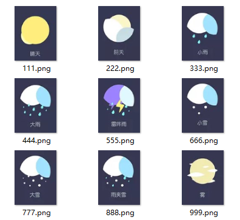

=======================
阶段实例
=======================

--------------------------
天气预报
--------------------------

判断一个变量立面的值，根据不同的值来显示不同的天气预报图片。
备选的图片是：

实现方式是用if和elif来实现。

更进一步的，并且根据图片的背景，我们来调整窗口的背景，图片背景色为55,55,83。

 