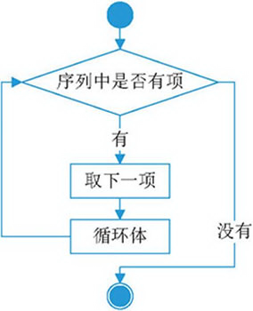

===================
使用for循环
===================
 
-----------
目标
-----------

- 了解循环
- for循环

--------------
循环简介
--------------

假如我打印出10遍“你好”。这个时候程序员会怎么做？

答：复制粘贴10遍`print('你好')`，做法如下：

.. code-block:: python

   print('您好')
   print('您好')
   print('您好')
   print('您好')
   print('您好')
   print('您好')
   print('您好')
   print('您好')
   print('您好')
   print('您好')

那么我们要循环100次呢？也需要重复的复制粘贴100次吗？

答案是：
我们要用到for循环。

那么我们现在来看看如何使用for循环，for循环的语法格式如下：

.. code-block:: console

   for 迭代变量 in 字符串、列表、元组、字典、迭代器：
      代码块
    
格式中，迭代变量用于存放从序列类型变量中读取出来的元素，所以一般不会在循环中对迭代变量手动赋值。
代码块指的是具有相同缩进格式的多行代码，由于是和循环结构联用，因此代码块又称为循环体。

for 循环语句的执行流程如图所示：

那么我们要怎么样应用for循环的知识，来改造上述效率不高的代码呢？
做法如下：

.. code-block:: python

   >>> for x in range(0,10):
       print('您好')
   
   您好
   您好
   您好
   您好
   您好
   您好
   您好
   您好
   您好
   您好

在上述代码内，用range函数来创造一个数字列表，它的范围是从起始数字开始到结束数字之前。

让我们来看看range函数是怎么工作的。range函数的作用是创造了一个“迭代器”，实现的效果相当于，类似于——注意是相当于——创造了一个列表：
迭代器就是python当中，专门用来和循环一起工作的对象。
那么如果我们把range和list结合起来，就得到了一个数字列表：

.. code-block:: python

   >>> print(list(range(0,10)))
   [0, 1, 2, 3, 4, 5, 6, 7, 8, 9]

那么实际上，就是从0开始循环，到10之前结束，实际上就是到9。
把其中的每次得到的数值，放到x当中。
那么我们使用x的值，来标识循环的次数

.. code-block:: python

   >>> for x in range(0,10):
       print('您好',x)
   
   您好 0
   您好 1
   您好 2
   您好 3
   您好 4
   您好 5
   您好 6
   您好 7
   您好 8
   您好 9

所以综上所述，循环帮我们少写了很多行代码。因此for循环语句是python中最常用的语句之一。

我们不用range，直接使用一个list进行循环也是可以的：

.. code-block:: python

   >>> y=['a','b','c','d']
   for x in y:
       print(x)
   a
   b
   c
   d

另一个遍历列表的例子：

.. code-block:: python

   name_list = ['Tom', 'Lily', 'Rose']
   
   for i in name_list:
       print(i)

.. note::

   for循环条件部分的冒号之后，是一个程序块，应该具有同样的缩进。

》》》》》》》》》》》》》》》》》》》》》》》》》》》》》》》》》》》》》》》》》》

----------------------
字典的循环遍历
----------------------

**遍历字典的key**

.. code-block:: python

   dict1 = {'name': 'Tom', 'age': 20, 'gender': '男'}
   for key in dict1.keys():
       print(key)

 

**遍历字典的value**

.. code-block:: python

   dict1 = {'name': 'Tom', 'age': 20, 'gender': '男'}
   for value in dict1.values():
       print(value)

 

**遍历字典的元素**

.. code-block:: python

   dict1 = {'name': 'Tom', 'age': 20, 'gender': '男'}
   for item in dict1.items():
       print(item)

**遍历字典的键值对**

.. code-block:: python

   dict1 = {'name': 'Tom', 'age': 20, 'gender': '男'}
   for key, value in dict1.items():
       print(f'{key} = {value}')

 
----------------------
循环改变
----------------------

循环当然是可以打断的。

**用break打断循环**

.. code-block:: python

   str1 = 'itheima'
   for i in str1:
       if i == 'e':
           print('遇到e不打印')
           break
       print(i)
 
 
**用continue打断循环**

.. code-block:: python

   str1 = 'itheima'
   for i in str1:
       if i == 'e':
           print('遇到e不打印')
           continue
       print(i)
 
 

**退出循环的方式**

需求：女朋友生气，要求道歉5遍：媳妇儿，我错了。
道歉到第三遍的时候，媳妇埋怨这一遍说的不真诚，是不是就是要退出循环了？
这个退出有两种可能性：

   - 更生气，不打算原谅，也不需要道歉了，程序如何书写？
   - 只一遍不真诚，可以忍受，继续下一遍道歉，程序如何书写？

**break**

.. code-block:: python

   i = 1
   while i <= 5:
       if i == 3:
           print('这遍说的不真诚')
           break
       print('媳妇儿，我错了')
       i += 1
   else:
       print('媳妇原谅我了，真开心，哈哈哈哈')

> 所谓else指的是循环正常结束之后要执行的代码，即如果是break终止循环的情况，else下方缩进的代码将不执行。

**continue**

.. code-block:: python

   i = 1
   while i <= 5:
       if i == 3:
           print('这遍说的不真诚')
           i += 1
           continue
       print('媳妇儿，我错了')
       i += 1
   else:
       print('媳妇原谅我了，真开心，哈哈哈哈')

 
因为continue是退出当前一次循环，继续下一次循环，所以该循环在continue控制下是可以正常结束的，当循环结束后，则执行了else缩进的代码。
 

 
 
 