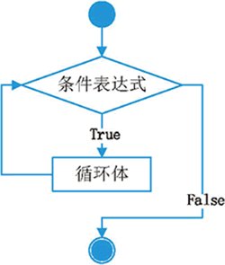

===================
使用while循环
===================
 

 
python语言不仅只有for循环，还有while循环。

while 语句的语法格式如下：

.. code-block:: console

   while 条件表达式：
      代码块
    
这里的代码块，指的是缩进格式相同的多行代码，不过在循环结构中，它又称为循环体。

while 语句执行的具体流程为：首先判断条件表达式的值，其值为真（True）时，则执行代码块中的语句，
当执行完毕后，再回过头来重新判断条件表达式的值是否为真，若仍为真，则继续重新执行代码块...如此循环，直到条件表达式的值为假（False），才终止循环。

while 循环结构的执行流程如图所示：

那么python已经有一个for循环了，为什么还要有一个while循环呢？
for循环一般是对一个序列，针对指定长度的数据的循环。而while循环，是针对某种状态的改变来停止的场景来执行循环的。
比如，我们可以在一栋楼里爬楼梯，到某一层，对程序来讲就是一个for循环，因为需要爬的楼梯数量恒定。

.. code-block:: python

   for x in range(1,100):
       print('爬了'+ str(x)+'级台阶')
  
    
而如果我们要爬山，山上有无数的楼梯层数，所以，当我们爬的时候如果精疲力尽，我们就会停止，或者在爬的时候突然下雨，我们也需要停止爬山。

.. code-block:: python

   rain=False
   step=0
   stop=False
   while stop==False:    
       if step>=1000:
           stop=True
       elif rain==True:
           stop=True
       else:        
           step=step+1
           print('爬到'+str(step))
           step+1

--------------------
列表的循环遍历
--------------------

需求：依次打印列表中的各个数据。

**while**

.. code-block:: python

   name_list = ['Tom', 'Lily', 'Rose']
   
   i = 0
   while i < len(name_list):
       print(name_list[i])
       i += 1

 

**简单实例**

需求：复现重复执行100次`print('媳妇儿，我错了')`（输出更简洁一些，我们这里设置5次）。

分析：初始值是0次，终点是5次，重复做的事情输出“媳妇儿， 我错了”。

.. code-block:: python

   # 循环的计数器
   i = 0
   while i < 5:
       print('媳妇儿，我错了')
       i += 1
   
   print('任务结束')
 

-------------------
while的应用
-------------------

**应用一：计算1-100累加和**

分析：1-100的累加和，即1 + 2 + 3 + 4 +….，即前两个数字的相加结果 + 下一个数字( 前一个数字 + 1)。

.. code-block:: python

   i = 1
   result = 0
   while i <= 100:
       result += i
       i += 1
   
   # 输出5050
   print(result)
 

注意：为了验证程序的准确性，可以先改小数值，验证结果正确后，再改成1-100做累加。

**应用二：计算1-100偶数累加和**

分析：1-100的偶数和，即 2 + 4 + 6 + 8....，得到偶数的方法如下：

- 偶数即是和2取余结果为0的数字，可以加入条件语句判断是否为偶数，为偶数则累加
- 初始值为0 / 2 , 计数器每次累加2

*方法一：条件判断和2取余数则累加*

.. code-block:: python

   # 方法一：条件判断和2取余数为0则累加计算
   i = 1
   result = 0
   while i <= 100:
       if i % 2 == 0:
           result += i
       i += 1
   
   # 输出2550
   print(result)
    

*方法二：计数器控制*

.. code-block:: python

   # 方法二：计数器控制增量为2
   i = 0
   result = 0
   while i <= 100:
       result += i
       i += 2
   
   # 输出2550
   print(result)
 
 