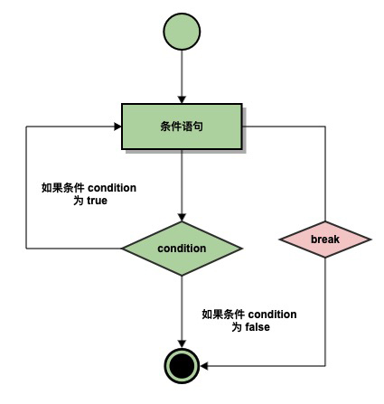
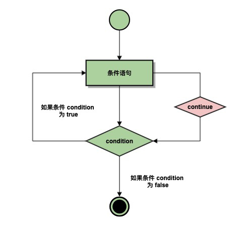

=======================
循环改变
=======================

-----------------
break 语句
-----------------

Python break语句，可以打破封闭for或while循环。

break语句用来终止循环语句，即循环条件没有False条件或者序列还没被完全递归完，也会停止执行循环语句。

break语句用在while和for循环中。

break关键字的流程图：

 
break使用时，大多和if判断语句一起使用，下面的例子打印字母，遇到h停止，打印数字，遇到5则停止：

.. code-block:: python

   for letter in 'Python':     # 第一个实例
      if letter == 'h':
         break
      print '当前字母 :', letter
     
   var = 10                    # 第二个实例
   while var > 0:              
      print '当前变量值 :', var
      var = var -1
      if var == 5:   # 当变量 var 等于 5 时退出循环
         break

执行的结果是：

.. code-block:: console

   当前字母 : P
   当前字母 : y
   当前字母 : t
   当前变量值 : 10
   当前变量值 : 9
   当前变量值 : 8
   当前变量值 : 7
   当前变量值 : 6

-----------------
continue 语句
-----------------
 
break跳出整个循环，而如果我们有时候，只想跳出本次循环，而不想终止整个循环，怎么办？

我们可以使用Python的continue语句跳出本次循环。

continue 语句用来告诉Python跳过当前循环的剩余语句，然后继续进行下一轮循环。

continue语句用在while和for循环中。

流程图：

continue使用时，大多和if判断语句一起使用。
下面的例子打印字母，遇到h跳过，打印数字，遇到5也跳过：

.. code-block:: python

   for letter in 'Python':     # 第一个实例
      if letter == 'h':
         continue
      print '当前字母 :', letter
    
   var = 10                    # 第二个实例
   while var > 0:              
      var = var -1
      if var == 5:
         continue
      print '当前变量值 :', var

以上实例执行结果：

.. code-block:: console

   当前字母 : P
   当前字母 : y
   当前字母 : t
   当前字母 : o
   当前字母 : n
   当前变量值 : 9
   当前变量值 : 8
   当前变量值 : 7
   当前变量值 : 6
   当前变量值 : 4
   当前变量值 : 3
   当前变量值 : 2
   当前变量值 : 1
   当前变量值 : 0

 