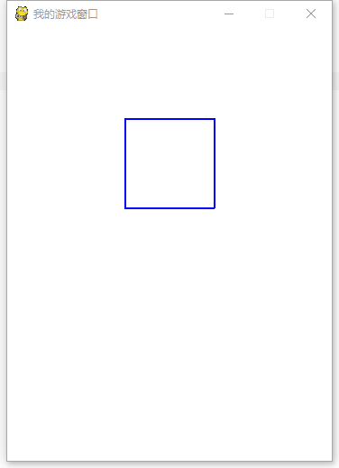
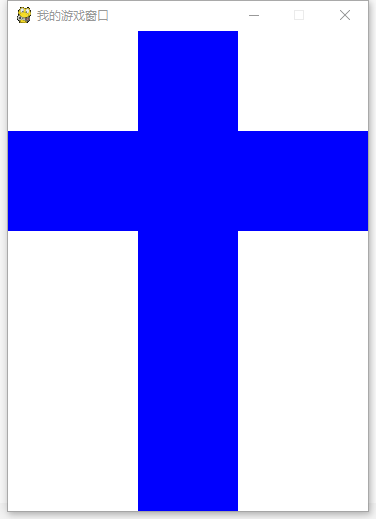
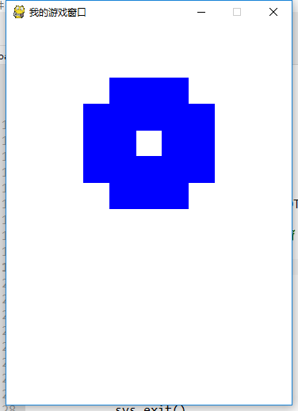

===============================
pygame机制
===============================

我们如何使得现在的pygame程序不报错呢？
我们可以在现有的pygame代码上加入下面的一段代码，则pygame窗口就不会报错了：

.. code-block:: python

   while True:
       for event in pygame.event.get():
           if event.type == pygame.QUIT:
               sys.exit()

这是一个循环，是说我循环监听pygame.event.get()函数获取到的pygame窗口得到的事件，如果是一个QUIT事件，则退出，否则继续监听。
就是说，点击窗口右上角的关闭按钮，则关闭。

那么程序就变成了：

.. code-block:: python

   import pygame
   import sys
   
   # Colors (R, G, B)
   BLACK = (0, 0, 0)
   WHITE = (255, 255, 255)
   RED = (255, 0, 0)
   GREEN = (0, 255, 0)
   BLUE = (0, 0, 255)
      
   WIDTH = 360  # 游戏窗口的宽度
   HEIGHT = 480 # 游戏窗口的高度
    
   pygame.init()
   screen = pygame.display.set_mode((WIDTH, HEIGHT))
   screen.fill(BLACK)
   pygame.display.set_caption("我的游戏窗口")#设置游戏窗口标题栏文字
   
   #定义初始位置
   pos_x= 130
   pos_y= 100
   shape= pos_x, pos_y, 100, 100
   width= 2
   pygame.draw.rect(screen, BLUE, shape, width)
   pygame.display.update()
   
   while True:
      for event in pygame.event.get():
          if event.type == pygame.QUIT:
              sys.exit()

这就是一个死循环。可以解决我们的问题，那么这是为什么呢？让我们来一起看一下pygame的基本的框架。

-------------------------
Pygame游戏结构框架
-------------------------

pygame的最小的游戏骨架类似下述图片所描述的：

.. image:: ../_static/c07/c07p01_i01_pygameframe.png

每个游戏的核心都是一个循环，将其称为“游戏循环”。这个循环一直在不断运行，一遍又一遍地完成游戏工作所需的所有事情。
每次循环显示一次游戏当前画面，称为帧。

**游戏主循环**

Pygame游戏循环，主要处理3件事情：

- 1.处理外部输入（鼠标点击或键盘按下事件）
   这意味着游戏在进行的同时，需要响应与处理用户的操作---这些可能是键盘上的键被按下，或鼠标被点击等事件。

- 2.更新游戏对象位置或状态
   如果飞机对象在空中飞行，收到重力作用，自身的位置需要改变。如果两个对象相互碰撞，则需要爆炸。

- 3.渲染
   此步骤中，在屏幕上重新绘制所有更新位置后的所有游戏对象。

-------------------------
Pygame游戏结构框架
-------------------------
所以现在，制作一个简单的pygame程序框架，需要把绘制逻辑部分：``pygame.draw.rect(screen, BLUE, shape, width)`` 
放到了while循环体立面，动态的绘制,再动态的更新当前的屏幕： ``pygame.display.update()``

所以，上述代码就变为：

.. code-block:: python

   import pygame
   import sys
   
   # Colors (R, G, B)
   BLACK = (0, 0, 0)
   WHITE = (255, 255, 255)
   RED = (255, 0, 0)
   GREEN = (0, 255, 0)
   BLUE = (0, 0, 255)
      
   WIDTH = 360  # 游戏窗口的宽度
   HEIGHT = 480 # 游戏窗口的高度
    
   pygame.init()
   screen = pygame.display.set_mode((WIDTH, HEIGHT))
   screen.fill(WHITE)
   pygame.display.set_caption("我的游戏窗口")#设置游戏窗口标题栏文字
   
   #定义初始位置
   pos_x= 130
   pos_y= 100
   width= 2 
   while True:
       for event in pygame.event.get():
           if event.type == pygame.QUIT:
               sys.exit()
       shape= pos_x, pos_y, 100, 100
       pygame.draw.rect(screen, BLUE, shape, width)
       pygame.display.update()

绘制出的效果是一样的:

虽然效果和之前的一样，但是本质却是不一样的，因为绘制逻辑变为每次刷新前动态绘制，并且不停刷新。
那么我们如何看到刷新的效果呢？
就让宽度增加1，也就是说，每次刷新，就增加一个像素的宽度：``width=width+1``
那么，while循环部分的代码变为

.. code-block:: python

   while True:
       for event in pygame.event.get():
           if event.type == pygame.QUIT:
               sys.exit()       
         
       width= width+1       
       shape= pos_x, pos_y, 100, 100       
       pygame.draw.rect(screen, BLUE, shape, width)       
       pygame.display.update()

这样一来，矩形的边变得越来越宽，这样，一个矩形就变成了一个十字架：

-------------------------
控制时间
-------------------------

上述的程序运行过程是动态的，但是比较快速，那么我们想延缓这种过称怎么办呢？
我们开始控制时间。
上述的程序运行较快，我们就让他慢下来，具体的，采用 ``pygame.time.delay()``
函数，来使得程序可以暂停一段时间，入参是暂停的毫秒数。
Pygame中的时间以毫秒（1/1000秒）表示。大多数平台的时间分辨率有限，大约为10毫秒。所以我们控制最好是10毫秒的倍数。
具体的：

.. code-block:: python

   while True:
       for event in pygame.event.get():
           if event.type == pygame.QUIT:
               sys.exit()
       pygame.time.delay(20)        
       width=width+1
       shape= pos_x, pos_y, 100, 100
       pygame.draw.rect(screen, BLUE, shape, width)
       pygame.display.update()

上述程序中的 ``pygame.time.delay(20)`` 就是让成型等待20个毫秒。
这时，我们就可以看到图形的演化过程了:

