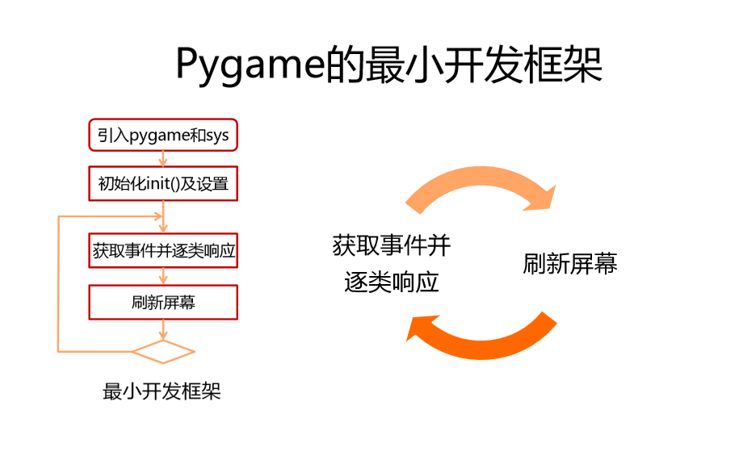

===============================
pygame机制
===============================

-----------
目标
-----------

- 理解面向对象
- 类和对象
- 添加和获取对象属性
- 魔法方法

-------------------------
Pygame游戏结构框架
-------------------------

pygame的最小的游戏骨架类似下述图片所描述的：

每个游戏的核心都是一个循环，将其称为“游戏循环”。这个循环一直在不断运行，一遍又一遍地完成游戏工作所需的所有事情。
每次循环显示一次游戏当前画面，称为帧。

**游戏主循环**

Pygame游戏循环，主要处理3件事情：

- 1.处理外部输入（鼠标点击或键盘按下事件）
   这意味着游戏在进行的同时，需要响应与处理用户的操作---这些可能是键盘上的键被按下，或鼠标被点击等事件。

- 2.更新游戏对象位置或状态
   如果飞机对象在空中飞行，收到重力作用，自身的位置需要改变。如果两个对象相互碰撞，则需要爆炸。

- 3.渲染
   此步骤中，在屏幕上重新绘制所有更新位置后的所有游戏对象。

--------------------------
构建Pygame游戏程序骨架
--------------------------

现在，制作一个简单的pygame程序，功能是除了打开一个窗口并运行游戏循环之外什么都不做。

在程序的开始部分，我们导入需要的库并为游戏设置一些变量：

.. code-block:: python

   import pygame
   import random
   
   WIDTH = 360  # 游戏窗口的宽度
   HEIGHT = 480 # 游戏窗口的高度
   FPS = 30 # 帧率

接下来，创建游戏窗口：

.. code-block:: python

   # initialize pygame and create window
   pygame.init()
   pygame.mixer.init()  #声音初始化
   screen = pygame.display.set_mode((WIDTH, HEIGHT))
   pygame.display.set_caption("My Game")#设置游戏窗口标题栏文字
   clock = pygame.time.Clock()

注意此处，游戏循环的另一个重要方面是控制整个循环的运行速度。
游戏中有个术语叫FPS（Frames Per Second），它代表每秒帧数，也叫帧率。
这意味着游戏循环每秒应发生多少次。这很重要，因为我们不希望游戏运行得太快或太慢。
也不希望它在不同的计算机上以不同的速度运行 。所以此处需要声明一个时钟变量供后续程序使用。

pygame.init()是启动pygame，并“初始化”它的命令。 
screen指的是游戏屏幕，按照在配置常量中设置的窗口大小创建它。
最后，创建了一个，clock时钟对象，以便能够确保游戏以想要的FPS运行。

让游戏循环：

.. code-block:: python

   # Game Loop
   running = True
   while running:
       # Process input (events)
       # Update
       # # Draw / Render

这是游戏循环，它是由变量running控制的循环。
如果希望游戏结束，只需要设置running为False，循环就会结束。
接下来用一些基本代码填写每个部分。

