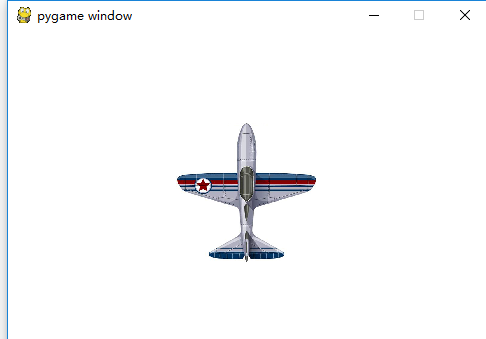

===============================
pygame机制
===============================

回忆一下pygame的使用：

使用pygame的第一步是将pygame库导入到python程序中，以便来使用它

.. code-block:: python

   import pygame

再经过初始化以后我们就可以尽情地使用pygame了。初始化pygame：

.. code-block:: python

   pygame.init()

通常来说我们需要先创建一个窗口，方便我们与程序的交互。下面创建了一个600 x 500的窗口

.. code-block:: python

   screen = pygame.display.set_mode((600,500))

准备打印字体，pygame支持使用pygame.font将文打印到窗口。要打印文本的话首先需要创建一个文字对象

.. code-block:: python

   myfont = pygame.font.Font(None,60)

这个文本绘制进程是一个重量级的进程，比较耗费时间，常用的做法是先在内存中创建文本图像，然后将文本当作一个图像来渲染。

.. code-block:: python

   white = 255,255,255
   blue = 0,0,200
   textImage = myfont.render("Hello Pygame", True, white)

textImage 对象可以使用screen.blit()来绘制。上面代码中的render函数第一个参数是文本，第二个参数是抗锯齿字体，第三个参数是一个颜色值（RGB值）。

要绘制本文，通常的过程是清屏，绘制，然后刷新。

.. code-block:: python

   screen.fill(blue)
   screen.blit(textImage, (100,100))
   pygame.display.update()

如果此时运行程序的话，会出现一个窗口一闪而过，或者在某些IDE里面，会卡住不动。
为了让它长时间的显示，我们需要将它放在一个循环中，在现有的pygame代码上加入下面的一段代码，则pygame窗口就不会报错了：

.. code-block:: python

   while True:
       for event in pygame.event.get():
           if event.type == pygame.QUIT:
               sys.exit()

这是一个循环，是说我循环监听pygame.event.get()函数获取到的pygame窗口得到的事件，如果是一个QUIT事件，则退出，否则继续监听。
就是说，点击窗口右上角的关闭按钮，则关闭。

那么程序就变成了：

.. code-block:: python
   :linenos:

   import pygame
   import sys
   
   pygame.init()
   screen = pygame.display.set_mode((600,500))
   myfont = pygame.font.Font(None,60)
   
   white = 255,255,255
   blue = 0,0,200
   
   textImage = myfont.render("Hello Pygame", True, white)
   
   screen.fill(blue)
   screen.blit(textImage, (100,100))
   pygame.display.update()
   
   while True:
      for event in pygame.event.get():
          if event.type == pygame.QUIT:
              sys.exit()

while部分是一个死循环，循环监听pygame运行后得到的系统事件。这样做就可以解决我们的问题，窗口不会一闪而过或者报错。
所谓事件，就是鼠标活在键盘被敲击，就是用户发出的一些命令。
那么我们加入了一个循环旧可以解决问题，这是为什么呢？
让我们来一起看一下pygame的基本的框架。

-------------------------
Pygame游戏结构框架
-------------------------

pygame的最小的游戏骨架类似下述图片所描述的：

每个游戏的核心都是一个循环，将其称为“游戏循环”。这个循环一直在不断运行，一遍又一遍地完成游戏工作所需的所有事情。
我们所说的游戏循环，就是把图像的视频逻辑，放到while的主循环内部。
每次进入while的循环体内部，处理一次改变逻辑，循环显示一次游戏当前画面，并调用一次 ``pygame.display.update()`` 。
更新一次称为一帧。

**游戏主循环**

Pygame游戏主循环的循环体内部，主要处理下列3件事情：

- 1.处理外部输入（鼠标点击或键盘按下事件）
   这意味着游戏在进行的同时，需要响应与处理用户的操作---这些可能是键盘上的键被按下，或鼠标被点击等事件。

- 2.更新游戏对象位置或状态
   如果飞机对象在空中飞行，收到重力作用，自身的位置需要改变。如果两个对象相互碰撞，则需要爆炸。

- 3.渲染
   此步骤中，更新绘制，并在屏幕上重新绘制所有更新位置后的所有游戏对象。

-------------------------
处理外部输入
-------------------------
 
获取键盘的输入，以便我们可以开放游戏的控制，

利用如下程序，可以监听获取游戏窗口运行时按下的按键，并打印到屏幕上：

.. code-block:: python
   :linenos:

   import pygame
   import sys 
    
   pygame.init()
   
   win = pygame.display.set_mode((640,480),0,32)
   while True:
       for event in pygame.event.get():
           if event.type==pygame.QUIT:
               sys.exit()        
           if event.type==pygame.KEYDOWN:
               key = event.key
               print(key)
               print(pygame.key.name(key))
            
在此程序运行的时候，可以试着按动键盘按键，看一下程序控制台的输出。
控制台会输出这两个消息，包含 key 属性，是一个整数的 id，代表键盘上具体的某个按键，pygame.key.name(key)是获取编号的按键名称，就是这个按键的字符串描述。

key属性的值是一个数字，为了方便使用，Pygame 将这些数字定义为以下这些常量：

- 数字被定义为K_0、K_1、K_2、K_3、K_4、K_5、K_6、K_7、K_8、K_9，分别代表了键盘上的数字按键。
- 从K_a、K_b、K_c一直到K_x、K_y、K_z，分别代表了26个字母按键。
- K_UP、K_DOWN、K_LEFT、K_RIGHT分别代表上下左右的方向按键。

那么如果我们像要开发一个游戏，让一个角色在一个范围内移动，那么我们首先需要能够让pygame程序感知我们的方向按键。
所以我们先写一个程序去感知方向按键。通过这些常量来抓取：

.. code-block:: python
   :linenos:

   import pygame
   import sys
   
   pygame.init()
   win = pygame.display.set_mode((640, 480), 0, 32)
   while True:
       for event in pygame.event.get():
           if event.type == pygame.QUIT:
               sys.exit()
           if event.type == pygame.KEYDOWN:
               key = event.key
               if key == pygame.K_UP:
                   print('向上走')
               if key == pygame.K_DOWN:
                   print('向下走')
               if key == pygame.K_LEFT:
                   print('向左走')
               if key == pygame.K_RIGHT:
                   print('向右走')
            
当键盘按键被按下和释放时，事件队列将获得 pygame.KEYDOWN事件消息，再根据按下的键盘打印出相关信息。

-------------------------
让飞起移动
-------------------------

.. code-block:: python
   :linenos:

   import pygame
   import sys
   
   WHITE = (255, 255, 255)
   
   pygame.init()
   screen = pygame.display.set_mode((480, 680), 0, 32)
   
   aircraft = pygame.image.load("aircraft1.jpg")
   aircraft = pygame.transform.scale(aircraft, (140, 140))
   
   pos_x=120
   pos_y=320
   step=12
   while True:
       for event in pygame.event.get():
           if event.type == pygame.QUIT:
               sys.exit()
           if event.type == pygame.KEYDOWN:
               key = event.key
               if key == pygame.K_LEFT:
                   pos_x=pos_x-step
               if key == pygame.K_RIGHT:
                   pos_x=pos_x+step
               if key == pygame.K_UP:
                   pos_y=pos_y-step
               if key == pygame.K_DOWN:
                   pos_y=pos_y+step
       screen.fill(WHITE)
       screen.blit(aircraft, (pos_x, pos_y))
       pygame.display.update()

这段程序是加载一个aircraft飞机图片，进入到我们的pygame窗口内，并缩放到一个合适的大小。
然后用pos_x和pos_y两个变量，来表示飞机的位置，

--------------------------
捕获键盘操作的第二种方法
--------------------------

python中捕获键盘操作一共有两种方法

第一种方法是我们上面介绍的，使用pygame中event方法使用方式如下：使用键盘右键为例

.. code-block:: python

   if event.type = pygame.KEYDOWN:
      if event.key =pygame.K_RIGHT: 
          print('向右移动')

第二种方法，使用pygame中的key模块

1，使用pygame.key.get_pressed()返回一个包含键盘中所有按键的元组，元组用一个变量接收。如：

.. code-block:: python
 
   keys_pressed = pygame.key.get_pressed()

2.通过键盘常量，判断元组中键盘的值来确认按键是否被按下。  如果被按下按键对应的值为1。如：

.. code-block:: python
   
   if keys_pressed[pygame.K_RIGHT]: 
      print('向右移动')

区别：

第一种方法，由于是用pygame.KEYDOWN事件进行判断，每次按完按键后必须松开按键才能触发，所以必须抬起才能继续下一次操作。灵活性不好。

第二种方法，是程序主动调用pygame.key.get_pressed()，主动去拿按键状态，所以不用抬起就可以触发，可以按住不松开，操作持续进行。灵活性好。

完整例子：

.. code-block:: python
   :linenos:

   import pygame
   import sys 
    
   pygame.init()
   
   win = pygame.display.set_mode((640,480),0,32)
   while True:
       for event in pygame.event.get():
           if event.type==pygame.QUIT:
               sys.exit()        
       keys_pressed = pygame.key.get_pressed()
       if keys_pressed[pygame.K_RIGHT]:
           print('向右移动')
            
---------------------
让飞机连续飞行
---------------------

根据第二种方法，对飞机控制事件进行改造：

.. code-block:: python
   :linenos:

   import pygame
   import sys
   
   WHITE = (255, 255, 255)
   pygame.init()
   screen = pygame.display.set_mode((480, 680), 0, 32)
   aircraft = pygame.image.load("aircraft1.jpg")
   aircraft = pygame.transform.scale(aircraft, (140, 140))
   pos_x = 120
   pos_y = 320
   step = 1
   while True:
       for event in pygame.event.get():
           if event.type == pygame.QUIT:
               sys.exit()
       keys_pressed = pygame.key.get_pressed()
       if keys_pressed[pygame.K_LEFT]:
           pos_x = pos_x - step
       if keys_pressed[pygame.K_RIGHT]:
           pos_x = pos_x + step
       if keys_pressed[pygame.K_UP]:
           pos_y = pos_y - step
       if keys_pressed[pygame.K_DOWN]:
           pos_y = pos_y + step
       screen.fill(WHITE)
       screen.blit(aircraft, (pos_x, pos_y))
       pygame.display.update()

这样，我们就可以按下按键，看见飞机在不停的连续移动。

------------
思考与练习
------------

把一个飞行变成两个飞机飞行，控制变成两人，由wasd方式和方向键方式进行控制。

------------
你学到了什么
------------
