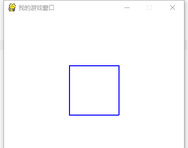
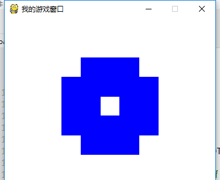

=======================
让事物自己动起来
=======================

上一小节呢，我们开始让一个飞机，受我们的键盘事件控制进行移动。
那么在一个游戏中，我们可以控制我方的角色，那么对方的角色呢，就需要自己可以移动和变化。
那么现在我们来看看实物的自我改变。
制作一个简单的pygame程序绘制一个矩形。
绘制逻辑部分应该是：``pygame.draw.rect(screen, BLUE, shape, width)`` 
回忆一下上一小节，每个游戏的核心都是一个循环，我们将其称为“游戏循环”。
这个循环一直在不断运行，一遍又一遍地完成游戏工作所需的所有事情。包括游戏的变更逻辑和绘制图形逻辑。
那么，如果我们想让一个矩形进行变化，那么我们就需要把绘制逻辑，放到while循环体立面，动态的绘制。
最后在循环体尾部，再动态的更新当前的屏幕： ``pygame.display.update()``

所以，上述代码就变为：

.. code-block:: python

   import pygame
   import sys
   
   # Colors (R, G, B)
   BLACK = (0, 0, 0)
   WHITE = (255, 255, 255)
   RED = (255, 0, 0)
   GREEN = (0, 255, 0)
   BLUE = (0, 0, 255)
      
   WIDTH = 360  # 游戏窗口的宽度
   HEIGHT = 480 # 游戏窗口的高度
    
   pygame.init()
   screen = pygame.display.set_mode((WIDTH, HEIGHT))
   screen.fill(WHITE)
   pygame.display.set_caption("我的游戏窗口")#设置游戏窗口标题栏文字
   
   #定义初始位置
   pos_x= 130
   pos_y= 100
   width= 2 
   while True:
       for event in pygame.event.get():
           if event.type == pygame.QUIT:
               sys.exit()
       shape= pos_x, pos_y, 100, 100
       pygame.draw.rect(screen, BLUE, shape, width)
       pygame.display.update()

绘制出的效果是这样的:

虽然效果和之前的一样，但是本质却是不一样的，因为绘制逻辑变为每次刷新前动态绘制，并且不停刷新。

那么我们如何看到刷新的效果呢？
就让宽度增加1，也就是说，每次刷新，就增加一个像素的宽度：``width=width+1``
此时，while循环部分的代码变为

.. code-block:: python

   while True:
       for event in pygame.event.get():
           if event.type == pygame.QUIT:
               sys.exit()       
         
       width= width+1       
       shape= pos_x, pos_y, 100, 100       
       pygame.draw.rect(screen, BLUE, shape, width)       
       pygame.display.update()

这样一来，矩形的边变得越来越宽，这样，一个矩形就变成了一个十字架：

-------------------------
改变速度
-------------------------

上述的程序运行过程是动态的，但是比较快速，刷新的速度，完全取决于while循环内的绘制逻辑。
更新逻辑计算完毕进行绘制后，就立刻刷新图形。
而while循环处理的速度，又跟我们的游戏主循环的复杂度，还有计算机的性能有一定的关系。

那么我们想延缓这种过称怎么办呢？
答案是，我们开始精确的控制时间。
上述的程序运行较快，我们就让他慢下来，具体的，采用 ``pygame.time.delay()``
函数，来使得程序可以暂停一段时间，入参是暂停的毫秒数。
Pygame中的时间以毫秒（1/1000秒）表示。大多数平台的时间分辨率有限，大约为10毫秒。所以我们控制最好是10毫秒的倍数。
具体的：

.. code-block:: python

   while True:
       for event in pygame.event.get():
           if event.type == pygame.QUIT:
               sys.exit()
       pygame.time.delay(20)        
       width=width+1
       shape= pos_x, pos_y, 100, 100
       pygame.draw.rect(screen, BLUE, shape, width)
       pygame.display.update()

上述程序中的 ``pygame.time.delay(20)`` 就是让程序等待20个毫秒。
也就是说，程序的循环体内部，每次运行到此处，就停止20毫秒。这样我们就能观测到程序的变化过程了。
这时，我们看到的演化过程:

-------------------------
物体自主移动
-------------------------

上一个小节，是使得矩形的边的厚度改变，来改变图形。
这一小节，我们通过改变图形的位置，让图像自己动起来。

.. code-block:: python

   import pygame
   import sys
   
   WHITE = (255, 255, 255)
   pygame.init()
   screen = pygame.display.set_mode((480, 680), 0, 32)
   aircraft = pygame.image.load("aircraft2.jpg")
   aircraft = pygame.transform.scale(aircraft, (140, 140))
   aircraft = pygame.transform.rotate(aircraft, 180)
   pos_x = 160
   pos_y = 20
   
   while True:
       for event in pygame.event.get():
           if event.type == pygame.QUIT:
               sys.exit()
       pygame.time.delay(20)
       pos_y = pos_y + 1
       shape = pos_x, pos_y, 100, 100
       screen.fill(WHITE)
       screen.blit(aircraft, (pos_x, pos_y))
       pygame.display.update()

我们的程序逻辑是，载入飞机的图片，并缩小到合适范围，并把飞机转到机头向下。
这时，我们就可以看到，飞机从上面向下面飞行了：

------------
思考与练习
------------
 
------------
你学到了什么
------------
