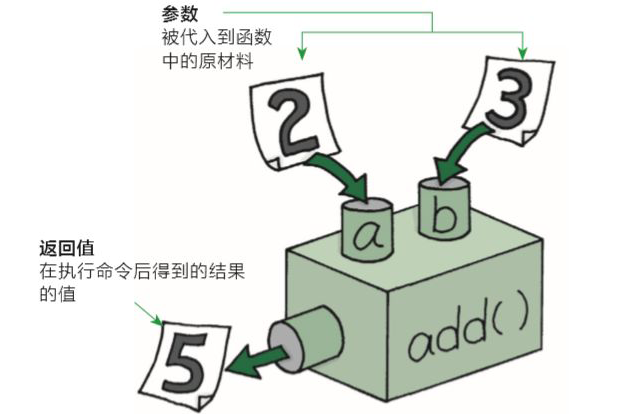
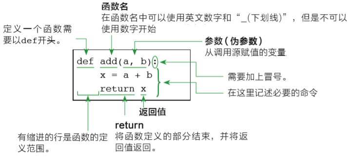

======================
使用函数
======================
 
函数是组织好的，可重复使用的，用来实现单一，或相关联功能的代码段。
函数能提高应用的模块性，和代码的重复利用率。
函数的实现方式是，把函数代码提前保存起来，并给它起一个独一无二的名字，只要知道它的名字就能使用这段代码。
函数还可以接收数据，并根据数据的不同做出不同的操作，最后再把处理结果反馈给我们。
你已经知道Python提供了许多内建函数，比如print()。
但你也可以自己创建函数，这被叫做用户自定义函数。

一个函数由三个部分构成，名字，参数，还有函数体。
那么，如何定义一个函数呢？下面是一个简单的例子：

.. code-block:: python

   def testfunc():
       print('你好')

函数的名称是testfunc。
它的函数体是以冒号结尾的行后面的代码块。
def是define的缩写。 

-----------------------
变量和作用域
-----------------------

参数是一个变量，只有这个函数被运行的时候，才会被创建和使用。
函数可以有两个，三个，或者任意多个参数。参数之间用逗号隔开。
你可以通过函数名称加括号的形式对一个函数进行调用，参数值被放到括号内部进行传入：

.. code-block:: python

   >>> def testfunc(name):
      print('你好:'+name)
   
   >>> testfunc('小刘')
   你好:小刘

那么我们什么时候，需要给一个函数加参数呢？加参数的目的是什么呢？

答案是：加参数是为了增加函数的灵活性和通用性。

比如我们需要编写一个函数，完成1和2两个数的加法运算，如何书写程序？

.. code-block:: python

   # 定义函数
   def add():
       result = 1 + 2
       print(result)
      
   # 调用函数
   add()

上述sum函数只能完成数字1和2的加法运算。
如果想要更灵活的计算两个数字的和，如何书写程序？

为了在调用函数的时候，能够指定具体数字，那么在定义函数的时候就需要预留出存储空间，即变量，来接收用户传入的数值。
在函数被调用的时候接收的数字就是函数的“入参”。

.. code-block:: python

   def add(a, b):
       result = a + b
       print(result)

   add(2, 3)

函数体内的变量，只有在函数被调用的时候才被创建出来，函数体执行结束后就不能再用了。
在我们编程领域，称这种变量被创造和激活使用的范围，称为变量的“作用域”。
比如，我们要在上述函数执行完毕后再次获取a的值，比如``print(a)`` ，则程序会报错：

.. code-block:: console

   NameError: name 'a' is not defined

这就说明了，在函数内定义的变量或者在函数声明时，定义的入参，其作用域只是函数体内部，函数执行完毕后，变量即失效。
在函数没被调用的时候，函数体内的变量，也不能使用。

-----------------------
函数的返回值作用
-----------------------

例如：我们去超市购物，比如买可乐，给钱之后，是不是售货员会返回给我们可乐这个商品。
在函数中，如果需要返回结果给用户需要使用函数返回值。

.. code-block:: python

   def buy():
       return '可乐'
   
   # 使用变量保存函数返回值
   goods = buy()
   print(goods)

下面我们利用return关键字，制作一个计算器，计算任意两数字之和，并保存结果和返回。

.. code-block:: python

   def add(a, b):
       return a + b   
   
   # 用result变量保存函数返回值
   result = add(2,3)
   print(result)

这样，就完成了一个相对较完整的加和函数:

 
---------------------------------
python函数返回多个return值
---------------------------------

python支持函数直接返回多个变量，用逗号隔开，具体用法如下:

.. code-block:: python

   >>> def test():
   ...     a=2
   ...     b=3
   ...     return a,b
   ...
   >>> print(test())
   (2, 3)
   >>> a,b=test()
   >>> print(a)
   2
   >>> print(b)
   3
   >>> print(test()[0])
   2
   >>> print(test()[1])
   3

----------------------
函数的知识点总结
----------------------

综上所述，我们知道了如何定义一个函数，以下是简单的规则：

- 函数代码块以 def 关键词开头，后接函数标识符名称和圆括号 ``()`` 。
- 任何传入参数和自变量必须放在圆括号中间。圆括号之间可以用于定义参数。
- 函数内容以冒号起始，并且缩进。
- return [表达式] 结束函数，选择性地返回一个值给调用方。不带表达式的return相当于返回 None。
 

------------
思考与练习
------------

------------
你学到了什么
------------
