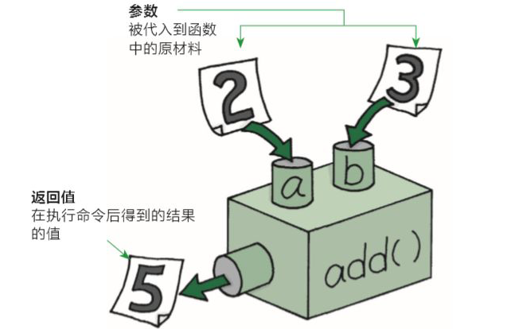
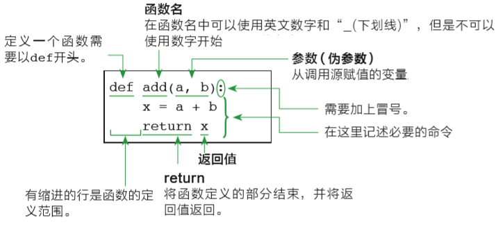

======================
使用函数
======================
 

--------
目标
--------

- 了解函数的作用
- 函数的使用步骤
- 函数的参数作用

--------------
函数的组成部分
--------------

一个函数由三个部分构成，名字，参数，还有函数体。

下面是一个简单的例子：

.. code-block:: python

   def testfunc():
       print('你好')

函数的名称是testfunc。它的函数体是以冒号结尾的行后面的代码块。def是define的缩写。

 

-----------------------
变量和作用域
-----------------------

参数是一个变量，只有这个函数被运行的时候，才会被创建和使用。函数可以有两个，三个，或者任意多个参数。参数之间用逗号隔开。

你可以通过函数名称加括号的形式对一个函数进行调用，参数值被放到括号内部：

.. code-block:: python

   >>> def testfunc(name):
      print('你好:'+name)
   
   >>> testfunc('小刘')
   你好:小刘

那么我们什么时候，需要给一个函数加参数呢？加参数的目的是什么呢？

答案是：加参数是为了增加函数的灵活性和通用性。

比如我们需要编写一个函数，完成1和2两个数的加法运算，如何书写程序？

.. code-block:: python

   # 定义函数
   def add():
       result = 1 + 2
       print(result)
      
   # 调用函数
   add()

上述sum函数只能完成数字1和2的加法运算。
如果想要更灵活的计算两个数字的和，如何书写程序？

为了在调用函数的时候，能够指定具体数字，那么在定义函数的时候就需要预留出存储空间，即变量，来接收用户传入的数值。
在函数被调用的时候接收的数字就是函数的“入参”。

.. code-block:: python

   def add(a, b):
       result = a + b
       print(result)

   add(2, 3)

函数体内的变量，只有在函数被调用的时候才被创建出来，函数体执行结束后就不能再用了。
在我们编程领域，称这种变量被创造和激活使用的范围，称为变量的“作用域”。
比如，我们要在上述函数执行完毕后再次获取a的值，比如``print(a)`` ，则程序会报错：

.. code-block:: console

   NameError: name 'a' is not defined

这就说明了，在函数内定义的变量或者在函数声明时，定义的入参，其作用域只是函数体内部，函数执行完毕后，变量即失效。

-----------------------
函数的返回值作用
-----------------------

例如：我们去超市购物，比如买可乐，给钱之后，是不是售货员会返回给我们可乐这个商品。
在函数中，如果需要返回结果给用户需要使用函数返回值。

.. code-block:: python

   def buy():
       return '可乐'
   
   # 使用变量保存函数返回值
   goods = buy()
   print(goods)

下面我们利用return关键字，制作一个计算器，计算任意两数字之和，并保存结果和返回。

.. code-block:: python

   def add(a, b):
       return a + b   
   
   # 用result变量保存函数返回值
   result = add(2,3)
   print(result)

这样，就完成了一个相对较完整的加和函数:

 
----------------------
函数的知识点总结
----------------------

综上所述，我们知道了如何定义一个函数，以下是简单的规则：

- 函数代码块以 def 关键词开头，后接函数标识符名称和圆括号 ``()`` 。
- 任何传入参数和自变量必须放在圆括号中间。圆括号之间可以用于定义参数。
- 函数内容以冒号起始，并且缩进。
- return [表达式] 结束函数，选择性地返回一个值给调用方。不带表达式的return相当于返回 None。
 

--------------
函数应用
--------------

**打印图形**

1. 打印一条横线

.. code-block:: python

   def print_line():
       print('-' * 20)
   
   print_line()

 
2. 打印多条横线

.. code-block:: python

   def print_line():
       print('-' * 20)
   
   
   def print_lines(num):
       i = 0
       while i < num:
           print_line()
           i += 1
   
   
   print_lines(5)

 
**函数计算**

1. 求三个数之和

.. code-block:: python

   def sum_num(a, b, c):
       return a + b + c
   
   
   result = sum_num(1, 2, 3)
   print(result)  # 6

2. 求三个数平均值

.. code-block:: python

   def average_num(a, b, c):
       sumResult = sum_num(a, b, c)
       return sumResult / 3
   
   result = average_num(1, 2, 3)
   print(result)  # 2.0

------------
思考与练习
------------

------------
你学到了什么
------------

