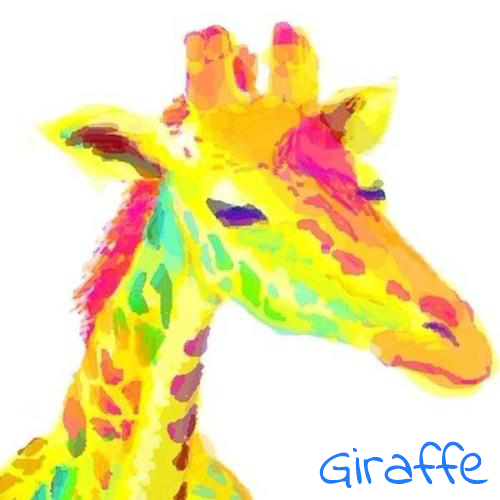
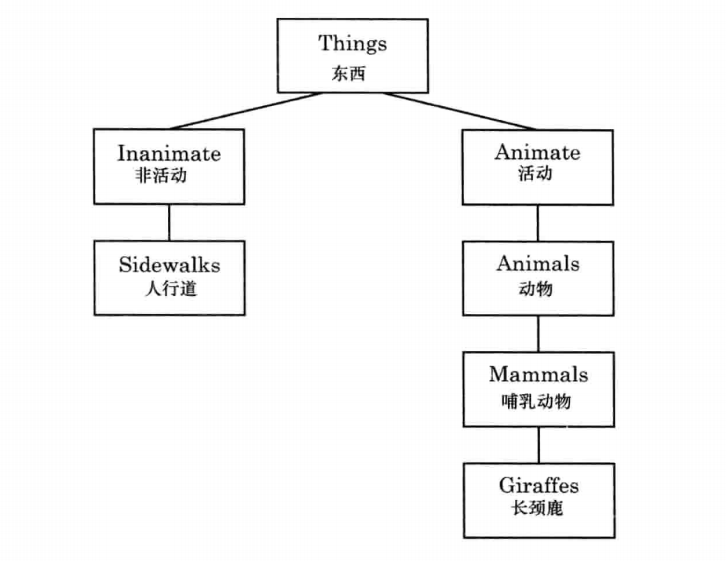
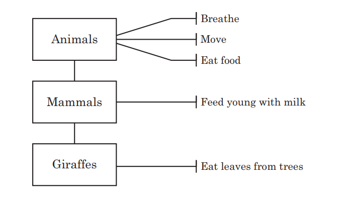
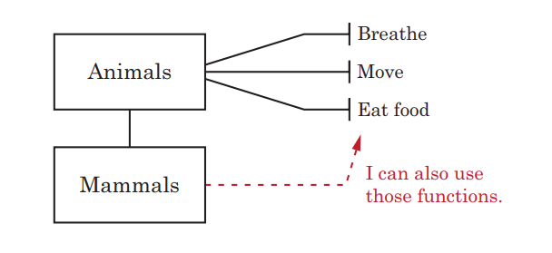

===============================
把事物抽象成类
===============================

长颈鹿和人行道之间是什么关系？
长颈鹿和人行道都是“事物”，在语言里面，被称为“名词”，在python里面，被称为“对象”。
在计算机世界里，“对象”这个概念很重要，面向对象编程，跟我们之前课程学习的顺序的编写程序的方式，都是程序组织代码的方法。
而面向对象的方法，是把更复杂的程序逻辑，按照面向对象的方式编写，使其更容易理解。

在python中，对象是“类”定义的，我们可以把“类”当成一种把对象分组归类的方法。那么下述图片是长颈鹿和人行道根据我们前面的定义进行归类的树状图：

这里的主要的类是Things“事物”。在“事物”类下面，有“活动”的和“非活动”，在“非活动”的下面，是人行道，在“活动”的下面，是“动物”，“哺乳动物”，和“长颈鹿”。

我们来创建树状图中的类，在python中，我们用class关键字来定义类，后面跟着类的名字。Things类是最根本的类，我们先创建它：

.. code-block:: python

   class thing:
      pass
      
定义一个最大的类Things，并用pass表示没有别的信息了。
   
---------------
父母与孩子
---------------

我们把树状图里的类：

.. code-block:: python

   class Things:
      pass
      
   class Inanimate(Things):
      pass
    
   class Animate(Things):
      pass

括号里是说明，本类的父类。

人行道类，继承了不可动事物：

.. code-block:: python

   class Sidewalks(Inanimate):
      pass

动物，哺乳动物，长颈鹿，逐一继承：

.. code-block:: python

   class Animals(Animate):
      pass
      
   class Mammals(Animals):
      pass
      
   class Giraffes(Mammals):
      pass

通过继承创建的新类称为“子类”或“派生类”，被继承的类称为“基类”、“父类”或“超类”。
继承的过程，就是从一般到特殊的过程。
在考虑使用继承时，有一点需要注意，那就是两个类之间的关系应该是“属于”关系。
例如，Employee 是一个人，Manager 也是一个人，因此这两个类都可以继承 Person 类。但是 Leg 类却不能继承 Person 类，因为腿并不是一个人。
那么“长颈鹿”是属于“动物”的，而“动物”属于“可动事物”类，而“可动事物”类和“不可动事物”类都属于“事物”

--------------------
创建属于类的对象
--------------------

现在我们已经有了几个类，下面我们给这些类加入一些成员。
假设我们有一只长颈鹿，名字叫jack，我们知道它是属于Giraffes类的，那么我们用什么样的程序术语，来描述这一只叫jack的长颈鹿呢？
我们称jack是Giraffes类的一个对象，也可以称jack对象是Giraffes类的一个实例。
具体的代码是：

.. code-block:: python

   jack = Giraffes()

这段代码就是告诉python，创建一个属于Giraffes类的一个对象，并把对象赋值给jack变量。

到目前为止，我们编写了类，并用类创建的对象，但是这些类和对象还需要加上函数才能进行工作。

-------------------------
用函数表示类的特征
-------------------------

看一下我们定义的Animate类，我们可以给这个类添加一些特征，来描述他是什么，他能做什么。这种特征就是这个类下的所有对象的共同特征。

观察这个图可以知道，所有动物都有的特征，是呼吸，移动，吃食物。我们把这些能力特征，在python的面向对象编程中，定义为类的对象所具备的函数。
那么Animals类就可以定义为：

.. code-block:: python

   class Animals(Animate):
      def breath(self):
         pass
      def move(self):
         pass
      def eat_food(self):
         pass
         
   class Mammals(Animals):
      pass
      
   class Giraffes(Mammals):
      def eat_leaves_from_trees(self):
         pass

当单独定义的时候，只使用def加函数名称和括号的方式，定义，并且函数体需要在冒号后面另起一行并带有缩进。
那么，把一个函数放入一个类里面，与直接定义类的不同在于，用于创建函数的def定义函数的程序块，本身是一个代码块，所以在类里面，也需要带有缩进。
并且这种被定义在类当中的函数，还给了它一个参数 ``self`` 。

这个self指的是什么？
其实，这个self是用来调用这个类的对象里面的其他函数的，我们稍后会看到具体的用法。

--------------------------
对象调用类函数
--------------------------

那么我们就可以利用类内的函数，规定这个类的对象具备那些功能，就是说，这个类的对象被创造出来的时候，带有哪些函数。
那么上述代码添加函数功能：

.. code-block:: python

   class Animals(Animate):
      def breath(self):
         print('呼吸')
      def move(self):
         print('移动')
      def eat_food(self):
         print('吃食物')

在类内部定义一个一般的函数，第一个入参应该是self，用来指代自己。
但是在调用这个函数的时候，可以使用类的对象加上点运算符``.`` 和函数名字来调用函数。
在这里可以看出，我们用类创建了一个对象，就可以通过这个对象来调用类里面事先定义好的函数：

.. code-block:: python

   animal=Animals()
   animal.breath()
   animal.move()
   animal.eat_food()

这样通过Animals类，创建了一个具体的动物animal，这时这个animal的对象，就可以对Animals类里面的函数进行调用了，显示的结果是：

.. code-block:: console

   呼吸
   移动
   吃食物

--------------------------
继承调用函数
--------------------------

针对继承的情况，子类的对象，是否也可以直接调用父类里面的函数呢？
我在高级的类里面，一次编写了若干的函数，那么他的子类也是可以直接调用的。
如图所示：

所以此时，我们创建2个长颈鹿对象：jack和rose，这时，这两个对象都隶属于Giraffes类，而Giraffes类继承了Mammals类，Mammals类继承了Animals类。
也就是说，任意一只长颈鹿，都是属于长颈鹿类的，而长颈鹿类属于哺乳动物类，而哺乳动物类属于动物类。

.. code-block:: python

   class Animals(Animate):
      def breath(self):
         print('呼吸')
      def move(self):
         print('移动')
      def eat_food(self):
         print('吃食物')
         
   class Mammals(Animals):
      pass
      
   class Giraffes(Mammals):
      def eat_leaves_from_trees(self):
         print('吃树上的叶子')
         
   mammal=Mammals()
   jack = Giraffes()
   rose = Giraffes()
   
   mammal.eat_food()
   
   jack.move()
   jack.eat_leaves_from_trees()
   
   rose.move()
   rose.eat_leaves_from_trees()

------------------------------------
对象内部函数调用其他内部函数
------------------------------------

通常，我们发现编写函数时，各个函数分段负责自己的逻辑过程，最后，由更高级的函数把各个函数组合起来，那么我们可以这样：

.. code-block:: python

   class Animals():
       def breathe(self):
           print('呼吸')
       def move(self):
           print('移动')
       def eat_food(self):
           print('吃食物')
        
   class Mammals(Animals):
       pass
     
   class Giraffes(Mammals):
       def find_food(self):
           self.move()
           print('找食物')        
           
       def eat_leaves_from_trees(self):
           self.find_food()
           print('找到树上的叶子')
           self.eat_food()
   
   jack = Giraffes()
   #jack.find_food()
   jack.eat_leaves_from_trees(
   
在类内调用类内的其他函数，仍然是用self来调用。
长颈鹿类在吃树叶的函数内，先调用了找食物函数，用self.find_food()直接调用即可。

------------
思考与练习
------------

------------
你学到了什么
------------
