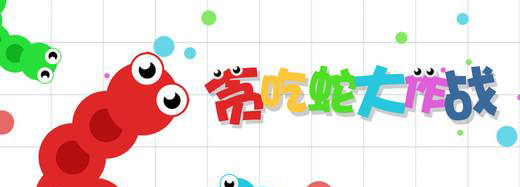
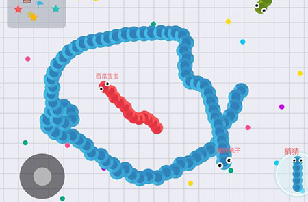
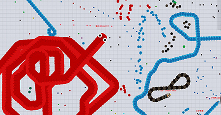

=====================
贪吃蛇
=====================

利用我们前十章所学的内容，学生在老师的带领下，开发一款贪吃蛇游戏。

第一步，实现基本的贪吃蛇游戏功能，用色块代替，效果如图：

.. image:: ../_static/c11/c11p01_i01_snake.png

给贪吃蛇游戏加上标题：

美化贪吃蛇个体，并支持贪吃蛇之间的对战：

可以产生非常大的贪吃蛇个体：

贪吃蛇死亡后，变成一串大号的奖品：

